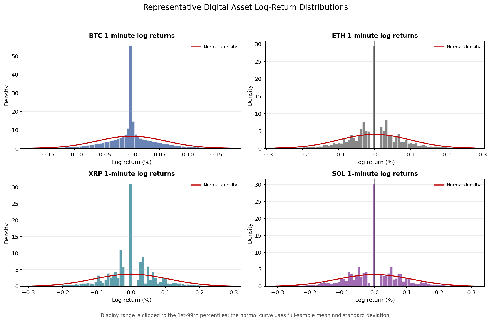
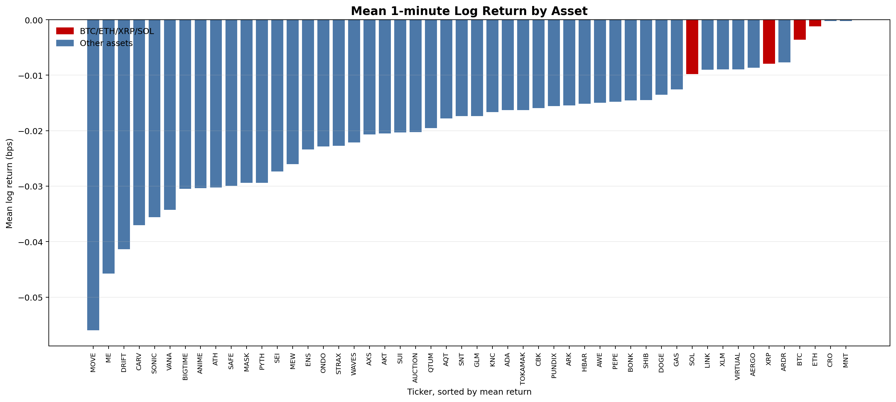
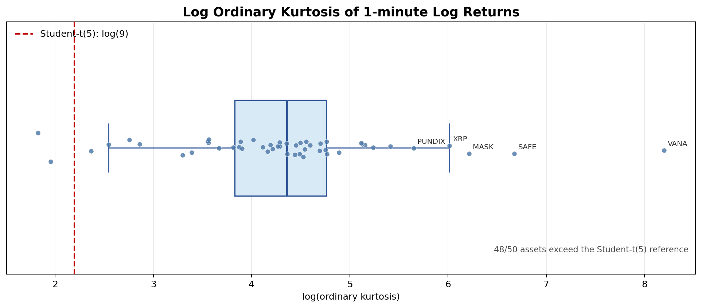

# 변동성 기반 디지털자산 공모펀드 조성 시스템 연구 및 사업화 전략

고빈도 변동성 행렬 기반 모델 포트폴리오와 B2B 운용 인프라 구현

## Abstract

본 연구는 국내 디지털자산 시장의 신규 유입 둔화와 공모형 투자상품 부재 문제를 배경으로, 고빈도 가격 데이터를 활용한 디지털자산 포트폴리오 조성 시스템을 제안한다. 주식시장에서는 ETF와 공모펀드가 투자자의 진입장벽을 낮추고 테마·섹터 단위 투자를 가능하게 하지만, 디지털자산 시장은 개별 종목 투자 중심으로 형성되어 있어 신규 투자자가 시장 흐름에 참여하기 어렵다. 본 연구는 Upbit KRW 마켓의 1분봉 가격 데이터를 기반으로 50개 유동성 자산을 선정하고, Pre-averaging Realized Volatility Matrix(PRVM), Matrix-valued EWMA, Long-only Minimum Variance Portfolio를 연결하여 변동성 기반 모델 포트폴리오를 구현하였다. 실험 결과, 25% 단일종목 cap을 적용한 monthly 14-day managed 전략은 동일 universe의 equal-weight 포트폴리오 대비 낮은 변동성, 낮은 최대낙폭, 높은 누적성과를 보였다. 또한 본 연구는 해당 시스템을 직접 운용 펀드가 아니라 기관 고객에게 API와 대시보드 형태로 제공하는 B2B 운용 인프라로 사업화하는 전략을 제시한다. 이는 BlackRock Aladdin과 유사하게 핵심 알고리즘은 보호하면서 분석 결과와 리밸런싱 지시를 제공하는 구조이며, 향후 디지털자산 제도화 국면에서 현물 기반 상품 개발을 선점하기 위한 기초 연구로 기능할 수 있다.

> [추가 보강 필요] Abstract는 최종 본문 완성 후 실험 수치와 contribution을 250~400자 또는 학교 요구 분량에 맞게 재압축하는 것이 좋다.

## Keywords

Digital Asset, Public Fund, Volatility Matrix, PRVM, EWMA, Minimum Variance Portfolio, Crypto Portfolio Infrastructure, B2B SaaS

---

## 1. Introduction: 문제 제기

### 1.1 연구 배경

국내 가상자산 및 블록체인 산업은 높은 개인투자자 참여와 활발한 원화마켓 거래를 기반으로 성장해 왔다. 그러나 시장의 성숙 과정에서 신규 투자자 유입은 둔화되고 있으며, 개별 코인 가격 변동에 의존하는 투기적 접근은 투자자의 피로도를 높이고 있다. 주식시장에서는 ETF, 공모펀드, 인덱스펀드와 같은 상품 구조가 투자자의 탐색 비용을 낮추고, 개별 종목을 직접 고르지 않아도 특정 시장 또는 섹터에 분산 투자할 수 있는 통로를 제공한다. 반면 디지털자산 시장에서는 아직 이러한 공모형 포트폴리오 상품의 구조가 충분히 정형화되어 있지 않다.

본 연구의 문제의식은 다음과 같다. 국내 가상자산·블록체인 산업의 침체는 단순히 가격 하락이나 투자심리 악화만으로 설명되기 어렵다. 더 근본적으로는 신규 유입자가 시장에 진입할 수 있는 표준화된 상품 구조가 부족하다. 주식시장 투자자는 반도체, 2차전지, AI, 바이오와 같은 시장 흐름에 ETF 또는 공모펀드를 통해 참여할 수 있지만, 디지털자산 투자자는 여전히 개별 코인을 직접 선택해야 하는 경우가 많다. 이 구조는 투자자에게 높은 정보 탐색 비용과 리스크 인식 부담을 전가한다.

따라서 디지털자산 시장의 다음 성장 국면에서는 개별 코인 투자 중심의 구조를 넘어, 다수 자산을 대상으로 한 데이터 기반 포트폴리오 조성 시스템이 필요하다. 본 연구는 이러한 문제의식에서 출발하여 디지털자산 공모형 상품 또는 모델 포트폴리오의 기초가 될 수 있는 정량 시스템을 설계하고 구현한다.

> [Figure 권장] Figure 1. 주식시장 ETF 구조와 디지털자산 개별투자 구조 비교. 왼쪽은 "시장/테마 → ETF → 투자자", 오른쪽은 "수많은 개별 코인 → 투자자 직접 선택"으로 시각화한다.

### 1.2 문제 상황의 구조화

본 연구의 문제의식은 5단계 질문 구조로 정리할 수 있다.

첫째, 국내 가상자산 시장은 왜 침체 또는 둔화 국면을 겪는가? 가장 직접적인 원인은 코인 시장에 대한 관심도 하락과 신규 투자자 유입 감소이다. 둘째, 왜 신규 유입이 어려운가? 디지털자산 시장은 주식시장에 비해 초보 투자자가 접근하기 어렵다. 셋째, 왜 접근성이 낮은가? 주식시장에는 ETF와 공모펀드가 있어 투자자가 개별 종목을 모두 분석하지 않아도 시장 흐름에 참여할 수 있지만, 디지털자산 시장은 개별 자산 선택이 중심이다. 넷째, 왜 개별 자산 선택 구조가 지속되는가? 디지털자산 시장에서는 공모형 포트폴리오 상품의 정형화가 부족하다. 다섯째, 왜 공모형 상품이 부족한가? 주식시장과 달리 디지털자산에는 널리 합의된 표준 산업 분류체계, 벤치마크, 위험관리 프레임워크가 부족하기 때문이다.

이 문제를 해결하기 위해서는 두 가지 접근이 동시에 필요하다. 하나는 포트폴리오를 구성할 수 있는 정량적 방법론이고, 다른 하나는 이를 기관 고객이 실제로 활용할 수 있는 시스템 형태로 구현하는 것이다. 본 연구는 첫 번째 접근으로 고빈도 변동성 행렬 기반 최소분산 포트폴리오를 구현하고, 두 번째 접근으로 대시보드 기반 B2B 인프라 모델을 제안한다.

> [Figure 권장] Figure 2. 5-Why 문제 구조. "시장 관심 감소 → 신규 유입 어려움 → 개별 종목 투자 부담 → 공모형 상품 부재 → 표준 분류체계 및 정량 시스템 부재"의 흐름을 도식화한다.

### 1.3 연구 필요성

디지털자산 시장에서 공모형 포트폴리오 상품이 활성화되려면 단순히 여러 코인을 묶는 것만으로는 부족하다. 디지털자산은 24시간 거래되고, 가격 변동성이 높으며, 급격한 jump와 heavy-tail 특성을 보인다. 따라서 전통적인 저빈도 수익률 기반 포트폴리오 구성 방식만으로는 위험을 안정적으로 설명하기 어렵다. 특히 다수 자산을 동시에 다루는 상품에서는 자산별 변동성뿐 아니라 자산 간 공분산 구조를 추정해야 한다.

본 연구가 1분 단위 가격 데이터를 사용하는 이유도 여기에 있다. 고빈도 데이터는 일별 종가만으로는 관측하기 어려운 장중 가격 변동과 공분산 구조를 포착할 수 있다. 이를 직접 검증하기 위해 50개 universe 중 시가총액 분포를 고려해 대형주 2종(ETH, DOGE), 중형주 1종(ATOM), 소형주·롱테일 2종(SAHARA, 1INCH)을 무작위 추출하여 KST 09:00 기준 24시간 틱 거래 데이터를 점검한 결과, **다섯 표본 전체에서 분당 평균 19.3회**의 체결이 관측되었다. 대형주는 1분당 평균 38~54회, 중·소형주도 거래가 발생한 분(active minute) 기준 평균 3회 이상이 체결되어, 1분 단위가 *synchronization unit*으로서 다중 체결을 포함하므로 단일 시점 가격의 microstructure noise를 자연스럽게 평활화한다. 자세한 분석은 §3.4와 Appendix B에 정리한다. 초 단위 데이터는 자산 간 비동기 거래와 희소 관측 문제가 커질 수 있고, 5분 또는 10분 데이터는 변동성 추정에 필요한 미세한 가격 움직임을 지나치게 축약할 수 있다.

### 1.4 연구 목적

본 연구의 목적은 다음 세 가지이다.

첫째, Upbit KRW 마켓의 1분 단위 가격 데이터를 이용하여 디지털자산 50개 universe의 일별 변동성 행렬을 추정한다. 이를 위해 microstructure noise와 jump를 고려할 수 있는 Pre-averaging Realized Volatility Matrix(PRVM)를 사용한다.

둘째, 추정된 일별 변동성 행렬을 EWMA 방식으로 예측하고, 예측된 공분산 행렬을 바탕으로 Long-only Minimum Variance Portfolio를 구성한다. 이때 포트폴리오가 특정 저변동성 자산에 과도하게 집중되는 문제를 완화하기 위해 25% 단일종목 cap을 적용한 상품형 후보를 실험한다.

셋째, 정량 모델을 단순 연구 코드에 머물게 하지 않고, 기관 고객이 사용할 수 있는 B2B 운용 인프라로 전환하는 사업화 전략을 제안한다. 이 시스템은 고객이 직접 코드를 보지 않고 대시보드와 API를 통해 포트폴리오 비중, 성과 지표, 리밸런싱 주문 방향을 확인하는 구조를 지향한다.

### 1.5 연구 질문

본 연구는 다음 질문에 답하고자 한다.

- 고빈도 디지털자산 데이터를 활용해 안정적인 변동성 행렬을 추정할 수 있는가?
- 변동성 예측 기반 최소분산 포트폴리오가 동일 50개 자산 universe의 equal-weight 전략 대비 위험을 줄일 수 있는가?
- 단일종목 cap과 monthly hold-window 구조를 적용했을 때 상품화 가능한 포트폴리오 구조를 만들 수 있는가?
- 해당 시스템을 직접 운용 펀드가 아니라 B2B 인프라 형태로 사업화할 수 있는가?

### 1.6 연구의 기여

본 연구의 기여는 다음과 같다.

첫째, 디지털자산 공모형 상품 조성을 위한 정량 시스템의 구조를 제시한다. 이는 단일 코인 투자 또는 단순 테마 포트폴리오가 아니라, 고빈도 가격 데이터에서 추정한 변동성 행렬을 기반으로 포트폴리오를 구성하는 방식이다.

둘째, PRVM, EWMA, Minimum Variance Optimization을 하나의 재현 가능한 파이프라인으로 구현하였다. 데이터 수집, PRVM 계산, EWMA 예측, 포트폴리오 최적화, 백테스트, 대시보드 데이터 생성 스크립트가 모듈별로 분리되어 있어 연구 재현성과 시스템 확장성을 확보한다.

셋째, 연구 결과를 B2B 운용 인프라 관점에서 해석하였다. 직접 자산을 운용하지 않고, 고객사가 상품을 출시하거나 운용할 수 있도록 분석 엔진과 대시보드를 제공하는 구조는 규제 리스크와 IP 보호 측면에서 현실적인 사업화 경로를 제공한다.

---

## 2. 선행 연구

### 2.1 디지털자산 투자상품 및 공모형 상품 연구

전통 금융시장에서 ETF와 공모펀드는 투자자의 진입장벽을 낮추는 핵심 장치이다. ETF는 거래소 상장성과 분산투자를 결합하여, 투자자가 특정 지수, 섹터, 테마에 손쉽게 접근할 수 있게 한다. 반면 디지털자산 시장에서는 BTC, ETH와 같은 대형 자산을 제외하면 개별 자산별 리스크와 정보 비대칭성이 크다. 투자자는 개별 프로젝트의 기술, 토큰 이코노미, 거래소 유동성, 규제 리스크를 직접 판단해야 한다.

디지털자산 공모형 상품이 제대로 작동하기 위해서는 최소한 세 가지 요소가 필요하다. 첫째, 투자 대상 universe를 구성할 기준이 필요하다. 둘째, universe 내부의 위험 구조를 측정할 방법이 필요하다. 셋째, 포트폴리오 비중을 산출하고 주기적으로 리밸런싱할 운영 체계가 필요하다. 본 연구는 이 중 두 번째와 세 번째 요소를 중심으로 시스템을 설계한다.

> [문헌 보강 필요] 디지털자산 ETF, crypto index fund, model portfolio 관련 국내외 선행연구 또는 산업 보고서를 추가한다. 최종 LaTeX 버전에서는 "투자상품 구조"와 "정량 포트폴리오 방법론" 문헌을 분리하는 것이 좋다.

### 2.2 고빈도 금융 데이터의 특성

고빈도 금융데이터는 저빈도 일별 데이터에 비해 더 많은 정보를 제공하지만, 동시에 여러 통계적 문제를 동반한다. 대표적으로 microstructure noise, heavy-tail, jump, asynchronous trading이 있다. 디지털자산 시장은 24/7 거래가 이루어지기 때문에 전통 주식시장의 장중·장마감 구조와 다르며, 특정 시간대에 유동성이 급격히 낮아지거나 특정 자산에 거래가 집중되는 현상이 나타날 수 있다.

일별 종가 수익률은 하루 동안의 총 변동만 보여주지만, 1분봉 수익률은 하루 내부에서 발생하는 변동성 clustering, 급격한 가격 jump, 자산 간 공분산 변화를 더 세밀하게 포착한다. 그러나 너무 짧은 주기에서는 거래 비동기성과 잡음이 커질 수 있다. 본 연구는 현재 확보 가능한 전 자산 동기화 가격 패널이 1분 단위라는 점과, 이후 EDA에서 1분봉 고빈도 변동성 특성이 뚜렷하게 관찰된다는 점을 고려하여 1분봉을 기본 추정 단위로 사용한다. 실제 체결 횟수 기반 거래 빈도 검증은 별도 raw trade-count 데이터가 필요하다.

### 2.3 실현변동성 및 변동성 행렬 추정 연구

실현변동성(realized volatility)은 고빈도 수익률의 제곱합을 통해 일정 기간의 변동성을 추정하는 접근이다. 단일 자산의 변동성뿐 아니라 다수 자산의 공분산 행렬도 고빈도 수익률 벡터의 외적합으로 추정할 수 있다. 하지만 단순 realized covariance matrix는 microstructure noise와 jump에 민감할 수 있다.

Pre-averaging 방식은 짧은 구간의 수익률을 가중 평균하여 noise의 영향을 줄이는 방법이다. 본 연구의 PRVM은 일별 1분 로그수익률 블록에서 pre-averaged return을 구성하고, jump truncation을 적용하여 jump-adjusted volatility matrix를 산출한다. 이후 PSD projection을 통해 수치적으로 안정적인 양의 준정부호 행렬을 확보한다.

### 2.4 FIVAR 논문의 방법론적 시사점

본 연구의 방법론적 출발점은 Shin, Kim, Wang, and Fan(2025)의 FIVAR 논문이다. 해당 논문은 heavy-tailed high-frequency financial observations에서 factor volatility와 idiosyncratic volatility의 동학을 동시에 모델링하는 고차원 변동성 행렬 모형을 제안한다. FIVAR는 고차원 변동성 행렬의 eigenvalue process, factor structure, sparsity, robust estimation을 포함하는 더 넓은 이론적 프레임워크이다.

본 연구는 FIVAR 전체 모형을 구현하지 않고, capstone project의 목적에 맞추어 PRVM 기반 변동성 행렬 추정과 포트폴리오 구성 부분을 단순화하여 사용한다. 구체적으로 FIVAR, POET, clustering, sparse factor modeling은 제외하고, 다음 흐름에 집중한다.

1. 1분봉 가격 데이터에서 일별 jump-adjusted PRVM을 계산한다.
2. Matrix-valued EWMA로 다음 날 covariance matrix를 예측한다.
3. 예측 covariance와 lagged jump volatility를 이용하여 minimum variance portfolio를 산출한다.
4. 동일 universe equal-weight 및 BTC HODL과 비교한다.

> [Figure 권장] Figure 3. FIVAR 원 논문 방법론과 본 연구 구현 범위 비교. "FIVAR 전체 구조" 중 PRVM, volatility forecast, portfolio optimization 부분만 색상으로 강조한다.

### 2.5 변동성 예측 방법론

변동성은 금융시계열에서 강한 persistence를 보인다. 즉, 최근 변동성이 높았던 시기에는 가까운 미래에도 변동성이 높게 유지되는 경향이 있다. EWMA(Exponentially Weighted Moving Average)는 이러한 특성을 반영하여 최근 데이터에 더 큰 가중치를 부여한다. RiskMetrics에서 널리 사용된 `lambda = 0.94`는 금융 실무에서 대표적인 변동성 예측 파라미터로 활용되어 왔다.

본 연구는 일별 PRVM 행렬 전체에 EWMA를 적용한다. 단일 자산 변동성이 아니라 50개 자산의 50 x 50 covariance matrix를 재귀적으로 갱신하기 때문에, 자산 간 상관구조의 시간 변화를 함께 반영할 수 있다.

### 2.6 포트폴리오 최적화 연구

Minimum variance portfolio는 기대수익률을 직접 예측하기보다 포트폴리오 분산을 최소화하는 자산배분 방식이다. 디지털자산 시장에서는 기대수익률 추정 오차가 매우 크기 때문에, 평균-분산 최적화에서 기대수익률 항을 사용하는 방식은 불안정할 수 있다. 이에 비해 minimum variance approach는 covariance matrix 추정에 집중하여 위험관리형 포트폴리오를 구성한다.

그러나 minimum variance portfolio는 특정 저변동성 자산에 비중이 과도하게 집중될 수 있다. 초기 uncapped 실험에서도 top weight가 90% 이상까지 상승하는 문제가 나타났다. 공모형 상품 또는 모델 포트폴리오로 제시하기 위해서는 단일종목 concentration risk를 제어해야 하며, 본 연구는 25% cap을 적용한 결과를 최종 상품형 후보로 해석한다.

---

## 3. 디지털자산 공모펀드 조성 시스템 개요

### 3.1 시스템의 정의

본 연구에서 말하는 "디지털자산 공모펀드 조성 시스템"은 연구자가 직접 투자자 자산을 운용하는 펀드가 아니다. 보다 정확하게는 기관 고객이 디지털자산 공모형 상품, 모델 포트폴리오, 리스크 관리형 상품을 설계할 때 활용할 수 있는 정량 인프라이다.

시스템은 고객사가 보유한 자산 universe 또는 사전에 정의된 거래소 universe를 입력으로 받아, 변동성 행렬 추정, 미래 위험 예측, 최적 비중 산출, 리밸런싱 주문 방향 제시, 성과 및 위험 지표 시각화를 수행한다. 고객은 핵심 코드를 직접 보지 않고 결과만 대시보드 또는 API를 통해 확인한다.

> [표현 주의] "공모펀드"라는 용어는 최종 제출본에서 규제상 의미가 강할 수 있다. 본문에서는 "공모형 상품", "모델 포트폴리오", "상품 조성 지원 시스템"을 병행 사용하고, 실제 법적 펀드 출시 여부는 별도 검토 대상으로 둔다.

### 3.2 시스템 전체 구조

시스템은 다음 여섯 개 모듈로 구성된다.

| 모듈 | 기능 | 구현 위치 |
|---|---|---|
| 데이터 수집 | Upbit KRW 마켓 1분봉 수집 및 후보 종목 필터링 | `src/phase1_data/` |
| 변동성 행렬 추정 | 일별 PRVM, raw PRVM, jump volatility 계산 | `src/phase3_prvm/` |
| 변동성 예측 | Matrix-valued EWMA forecast | `src/phase4_ewma/` |
| 포트폴리오 최적화 | Long-only minimum variance, cap 적용 | `src/phase5_portfolio/` |
| 백테스트 | BTC, equal-weight, minimum variance 비교 | `src/phase6_backtest/` |
| 대시보드 | 성과, 주문, 비중, 월별 결과 시각화 | `dashboard/` |

> [Figure 권장] Figure 4. 시스템 아키텍처. 데이터 input, black-box engine, dashboard output을 세 단계로 나누고 각 phase를 연결한다.

### 3.3 데이터 파이프라인

데이터 수집 대상은 Upbit KRW 마켓이다. 전체 KRW 마켓 254개 중 스테이블코인 5개를 제외하고, 2025년 2월부터 2026년 3월까지 14개월 데이터가 모두 존재하는 148개 후보를 확보하였다. 이후 24시간 이상 연속 거래량 0인 자산을 제외하고, 평균 거래대금 기준 상위 50개를 최종 universe로 선정하였다.

| 필터 단계 | 종목 수 | 비고 |
|---|---:|---|
| Upbit KRW 전체 마켓 | 254 | `api.upbit.com/v1/market/all` 기준 |
| 스테이블코인 제외 후 | 249 | USD1, USDC, USDE, USDT, USDS 제외 |
| 14개월 데이터 보유 후보 | 148 | 2025-02 ~ 2026-03 |
| 연속 volume=0 필터 후 | 143 | 24시간 이상 무거래 제외 |
| 평균 거래대금 상위 50 | 50 | 최종 universe |

> [Table 권장] Table 1. 데이터 필터링 단계별 종목 수. 위 표를 그대로 사용 가능하다.

최종 가격 패널은 KST 기준 1분 timestamp를 index로 하고, 50개 자산의 close price를 columns로 갖는 wide-format 데이터이다. trading day는 Upbit 기준을 고려하여 KST 09:00부터 다음날 09:00까지로 정의하였다. 이는 국내 원화마켓의 거래일 구분과 일별 변동성 행렬 산출 기준을 일관되게 맞추기 위한 선택이다.

### 3.4 데이터 주기 선택의 근거: 1분봉 사용 이유

본 연구는 변동성 행렬 추정의 입력 데이터로 1분봉 가격 데이터를 사용한다. 그 이유는 세 가지이다.

첫째, 1분 단위는 *synchronization unit*으로서 대부분의 자산에서 실제로 다중 체결을 포함한다. 이를 직접 검증하기 위해 50개 universe 중 시가총액 분포를 고려해 대형주 2종(ETH, DOGE), 중형주 1종(ATOM), 소형주·롱테일 2종(SAHARA, 1INCH)을 무작위 추출하고, 각 자산별 임의 일자의 KST 09:00 기준 24시간(총 1,440분) 틱 거래 데이터를 집계하였다. 결과는 다음과 같다.

| 자산 (일자) | 총 틱 수 | 1분당 평균 틱 (/1440) | 거래 발생 분 비중 | 거래 발생 분당 평균 틱 | p90 | max |
|---|---:|---:|---:|---:|---:|---:|
| KRW-ETH (2026-02-22) | 77,240 | 53.64 | 100.0% | 53.64 | 100.1 | 1,383 |
| KRW-DOGE (2026-01-04) | 55,362 | 38.45 | 99.7% | 38.58 | 80.0 | 1,674 |
| KRW-ATOM (2026-01-05) | 3,171 | 2.20 | 58.6% | 3.76 | 8.0 | 70 |
| KRW-SAHARA (2025-11-17) | 2,297 | 1.60 | 42.6% | 3.74 | 9.0 | 61 |
| KRW-1INCH (2026-01-08) | 877 | 0.61 | 21.5% | 2.84 | 7.0 | 21 |

다섯 표본 전체 합계는 138,947 ticks이며, 단순 평균으로 환산하면 **분당 19.3회 체결, 거래 발생 분(active minute) 기준 평균 20.5회 체결**이다. 대형주(ETH·DOGE)는 1분당 평균 38~54회 체결되어 1분 집계 시 정보 손실이 무시할 만한 수준이고, 중·소형주도 거래가 발생한 분 기준으로는 평균 3회 이상의 체결이 관측된다. 따라서 1분 윈도우 내에서 다중 체결이 자연스럽게 평활화되어, 단일 시점 가격이 흡수하는 microstructure noise 영향이 1분 close price에서는 상당 부분 완화된다. 보고서용 EDA 구간에서는 50개 자산 모두에 대해 자산별 568,800개의 1분 로그수익률 관측치를 확보한다. 자산별 평균 거래 빈도 표 원본과 추출 일자 선정 절차는 Appendix B를 참고한다.

둘째, 그보다 미세한 frequency(초·5초)는 소형 자산에서 sparsity 문제를 일으킨다. 위 표에서 1INCH는 분당 0.61회 체결로 이미 약 78.5%의 분이 zero-trade인데, 이를 초 단위로 내릴 경우 zero-trade interval 비중이 극단적으로 커져 50개 universe 전체의 동기화된 가격 패널을 구성하기 어렵다. 즉, 초 단위 데이터는 대형 자산에만 유용하고 universe 단위 covariance 추정에는 부적합하다.

셋째, 5분 또는 10분 단위는 microstructure noise를 완화하는 데 도움이 되지만, 변동성 행렬 추정 단계에서는 정보 손실이 크다. 대형 자산의 분당 38~54회 체결 정보를 5~10배 단위로 축약하면 jump, volatility clustering, 자산 간 공분산 변화처럼 본 연구의 핵심 추정 대상이 묽어진다. 또한 PRVM의 pre-averaging 구조는 1분 단위 수익률에서 발생할 수 있는 잔여 noise를 추가로 완화하도록 설계되어 있어, 1분봉은 관측 빈도와 추정 안정성 사이의 적절한 절충점이 된다. 이는 FIVAR(Shin et al. 2025)의 pre-averaging 권고 frequency와도 부합하며, 본 연구는 이상의 근거로 **m = 1,440 (24h × 60min)** 을 base sampling grid로 채택한다.

포트폴리오 성과 평가는 실험 설계에 맞추어 10분 수익률 기준으로 수행하였다.

### 3.5 최종 포트폴리오 Universe

최종 universe는 평균 거래대금 기준 상위 50개 디지털자산이다. 상위 12개 자산은 다음과 같다.

| Rank | Ticker | Name | Korean Name | Avg Trade Value |
|---:|---|---|---|---:|
| 1 | XRP | XRP | 엑스알피(리플) | 374.1M KRW/min |
| 2 | BTC | Bitcoin | 비트코인 | 192.9M KRW/min |
| 3 | ETH | Ethereum | 이더리움 | 170.6M KRW/min |
| 4 | SOL | Solana | 솔라나 | 85.5M KRW/min |
| 5 | DOGE | Dogecoin | 도지코인 | 78.1M KRW/min |
| 6 | AERGO | Aergo | 아르고 | 41.2M KRW/min |
| 7 | ADA | Ada | 에이다 | 35.4M KRW/min |
| 8 | AUCTION | Bounce | 바운스토큰 | 30.0M KRW/min |
| 9 | ONDO | Ondo Finance | 온도파이낸스 | 28.1M KRW/min |
| 10 | SUI | Sui | 수이 | 27.5M KRW/min |
| 11 | VIRTUAL | Virtuals Protocol | 버추얼프로토콜 | 24.9M KRW/min |
| 12 | ARDR | Ardor | 아더 | 21.0M KRW/min |

이 universe는 BTC, ETH, SOL과 같은 대형 글로벌 자산뿐 아니라 AERGO, ARDR, CBK, AQT 등 국내 거래소에서 거래가 활발한 자산을 포함한다. 이는 한국 원화마켓의 특수성을 반영한다. 따라서 본 연구의 포트폴리오는 글로벌 시가총액 비중 포트폴리오라기보다, 국내 현물 거래 수요와 유동성을 반영한 KRW-market tradable universe라고 해석하는 것이 적절하다.

### 3.6 디지털자산 가격 데이터의 기초 EDA

방법론에 들어가기 전에, 최종 선정된 디지털자산 가격 데이터 자체의 분포적 특성을 확인할 필요가 있다. 본 연구의 핵심 방법론인 PRVM은 단순 표본분산이 아니라 고빈도 가격 자료의 microstructure noise, jump, heavy-tail 문제를 고려하기 위한 도구이다. 따라서 실제 데이터가 이러한 특성을 보이는지 EDA를 통해 먼저 제시하면 방법론 선택의 설득력이 높아진다.

보고서용 EDA는 `price_panel.csv`의 `trading_day` 기준으로 2025-03-01부터 2026-03-30까지 사용하였다. 원천 패널은 2026-03-31 23:59까지 존재하지만, `trading_day = 2026-03-31`은 900개 분봉만 포함된 partial day이므로 보고서용 그림과 요약 통계에서는 제외하였다. 그 결과 50개 자산 모두에서 568,800개의 1분 로그수익률과 395개의 일별 로그수익률 관측치를 확보하였다.

첫 번째 EDA는 대표 자산의 1분 로그수익률 분포이다. BTC, ETH, XRP, SOL처럼 거래대금이 크고 시장 대표성이 높은 자산을 선정하여 histogram을 그리고, 동일 평균과 표준편차를 갖는 정규분포 밀도곡선을 함께 표시하였다. 극단값으로 인해 중심부가 과도하게 눌려 보이는 문제를 피하기 위해 Figure 5의 x축은 각 자산별 1%~99% 분위수 구간으로 제한하였으며, 정규분포 곡선은 전체 표본의 평균과 표준편차를 사용하였다.

대표 자산의 1분 수익률 표준편차는 BTC 6.04 bps, ETH 9.85 bps, XRP 10.81 bps, SOL 11.43 bps로 나타났다. 같은 기간 BTC의 1분 수익률 범위는 -1.79%~1.65%였으나, XRP는 -7.21%~11.99%까지 관측되어 개별 자산의 tail event 규모가 크게 다르다는 점을 보여준다.

| Ticker | Mean 1m (bps) | Std 1m (bps) | Min 1m (%) | Max 1m (%) | Ordinary kurtosis | Log kurtosis |
|---|---:|---:|---:|---:|---:|---:|
| BTC | -0.0036 | 6.0444 | -1.7868 | 1.6542 | 27.0700 | 3.2984 |
| ETH | -0.0012 | 9.8536 | -2.2551 | 4.1439 | 35.2609 | 3.5628 |
| XRP | -0.0079 | 10.8147 | -7.2148 | 11.9895 | 408.7313 | 6.0131 |
| SOL | -0.0098 | 11.4264 | -3.0052 | 5.0892 | 34.9627 | 3.5543 |

두 번째 EDA는 선정된 50개 자산의 평균 1분 로그수익률이다. Figure 6은 자산별 평균 수익률을 bps 단위로 정렬한 결과이다. 분석 기간이 전반적으로 약세 구간이었기 때문에 50개 자산 모두 평균 1분 로그수익률이 음수였으며, 범위는 MOVE의 -0.0560 bps부터 MNT/CRO의 -0.0002 bps 수준까지 분포하였다.

세 번째 EDA는 log ordinary kurtosis box plot이다. 기존 Phase 2 리포트의 `kurtosis_1m`은 excess kurtosis 기준이므로, 본 보고서용 그림에서는 `ordinary kurtosis = excess kurtosis + 3`으로 변환한 뒤 log를 취했다. Student-t distribution with degrees of freedom 5의 ordinary kurtosis는 9이므로, 기준선은 `log(9) = 2.197`로 설정하였다.

50개 자산의 log ordinary kurtosis 중앙값은 4.360, 평균은 4.332로 나타났으며, 48개 자산이 Student-t(5) 기준선보다 높은 값을 보였다. ordinary kurtosis 기준으로는 중앙값 78.23, 평균 182.75, 최대 3,642.92까지 관측되었다. 이는 디지털자산 1분 로그수익률이 정규분포뿐 아니라 상당히 heavy-tailed한 기준분포와 비교해도 두꺼운 꼬리를 갖는다는 근거이다.

기존 Phase 2 distribution report에서도 같은 방향의 결과가 확인된다. 1분봉 excess kurtosis 평균은 약 179로 매우 높고, 일별 수익률로 집계한 뒤에도 평균 excess kurtosis가 약 14 수준으로 남아 있다. 이는 1분봉에서 관찰되는 heavy-tail이 단순한 초단기 잡음만은 아니며, 낮은 빈도로 집계한 뒤에도 디지털자산 수익률의 두꺼운 꼬리가 완전히 사라지지 않음을 의미한다.

이상의 EDA는 본 연구의 방법론 선택을 정당화하는 연결고리이다. 대표 자산의 로그수익률 분포가 fat-tail을 보이고, 자산별 평균 수익률이 표본 기간에 민감하며, log kurtosis box plot이 강한 heavy-tail 특성을 보여주기 때문에 단순 수익률 평균 예측이나 일별 sample covariance보다 고빈도 변동성 행렬 기반 접근이 더 적절하다. 동시에 일별 집계 결과를 보조 근거로 제시함으로써, 1분봉 분석이 초단기 잡음만을 과도하게 해석하는 것이 아니라 디지털자산 가격 자료의 구조적 특성을 포착하기 위한 단계임을 명확히 한다. 본 절의 산출물은 `scripts/run_phase2_report_eda.py`로 생성되며, 전체 요약 CSV는 `data/processed/phase2_eda/report_log_return_summary.csv`에 저장된다.

---

## 4. 방법론

### 4.1 데이터 전처리

원천 데이터는 Upbit의 월별 1분봉 CSV이다. 각 CSV에는 `date_time_utc`, `open`, `high`, `low`, `close`, `acc_trade_price`, `acc_trade_volume`이 포함된다. 전처리 과정에서는 UTC timestamp를 KST로 변환하고, 50개 최종 자산에 대해 close price wide panel을 구성한다. 결측치는 forward fill 후 backward fill로 처리되었으며, 최종 가격 패널에는 결측치가 없도록 정리되었다.

분석 기간은 2025-03-01부터 2026-03-30까지이다. 2025-02-01부터 2025-02-28까지의 기간은 첫 forecast target을 위한 28일 rolling EWMA window로 사용되며, 실제 forecast target은 2025-03-01부터 시작한다.

앞선 EDA에서 확인할 로그수익률의 fat-tail, 자산별 수익률 이질성, 높은 log kurtosis는 본 연구가 PRVM 기반 변동성 행렬 추정을 사용하는 직접적인 동기이다. 즉, 4장의 방법론은 임의로 선택된 수학적 절차가 아니라, 3.6절에서 관찰되는 디지털자산 데이터의 분포적 특성에 대응하기 위한 추정 전략이다.

> [Table 권장] Table 3. 데이터 전처리 요약. 기간, 자산 수, 분봉 행 수, trading day 수, 결측치 처리 전후 수치를 포함한다.

### 4.2 PRVM 기반 변동성 행렬 추정

일별 PRVM은 KST 09:00 기준 하루에 해당하는 1분 로그수익률 블록을 입력으로 계산한다. 하루는 24시간이므로 `m = 1440`개의 1분 수익률을 갖는다. Pre-averaging window는 `K = floor(sqrt(1440)) = 37`로 설정하였다.

> [Formula] PRVM 추정식
>
> $$
> \widehat{\Gamma}_d =
> \frac{1}{\psi K}
> \sum_{k=0}^{m-K}
> \overline{Y}_{d,k}\overline{Y}_{d,k}^{\top}
> \mathbf{1}\{|\overline{Y}_{d,k}| \le u_d\}
> - \text{bias correction}
> $$
>
> 여기서 $m=1440$, $K=37$, $\psi=1/12$이며, $u_d$는 jump truncation threshold이다.

계산 절차에서는 raw PRVM, jump-adjusted PRVM, jump volatility matrix를 모두 산출한다. PRVM 산출 후에는 eigenvalue floor를 `1e-10`으로 설정한 PSD projection을 적용한다. 이는 covariance matrix가 수치적으로 양의 준정부호가 되도록 보장하고, 이후 QLIKE 계산에서 log determinant가 발산하지 않도록 하기 위한 처리이다.

PRVM 산출 결과의 주요 요약 통계는 다음과 같다.

| 항목 | 값 |
|---|---:|
| PRVM 일수 | 423 |
| 기간 | 2025-02-01 ~ 2026-03-30 |
| 자산 수 | 50 |
| PRVM shape | 423 x 50 x 50 |
| PSD floor | 1e-10 |
| PRVM trace min | 0.0210 |
| PRVM trace max | 0.9788 |
| 평균 jump trace ratio | 13.44% |

이 결과는 jump component가 전체 realized volatility에서 무시할 수 없는 비중을 차지한다는 점을 보여준다. 평균 jump trace ratio가 약 13.44%라는 것은 raw PRVM에서 jump-adjusted PRVM을 제외한 jump component가 전체 trace의 일정 부분을 설명한다는 의미이다.

> [Figure 권장] Figure 8. PRVM trace와 jump trace ratio 시계열. 변동성이 급등한 날짜를 표시하고 시장 이벤트와 연결하면 해석력이 높아진다.

### 4.3 Jump Volatility 분리

본 연구는 raw PRVM과 jump-adjusted PRVM의 차이를 jump volatility로 정의한다.

> [Formula] Jump volatility
>
> $$
> \widehat{JV}_d = \widehat{\Gamma}^{raw}_d - \widehat{\Gamma}^{jump-adjusted}_d
> $$

Jump volatility는 다음날 포트폴리오 목적함수에 포함된다. 이는 전일 jump component가 단기 위험 예측에 추가 정보를 제공할 수 있다는 가정에 기반한다. 디지털자산 시장은 급격한 가격 jump가 자주 발생할 수 있으므로, jump component를 완전히 제거하기보다 별도 위험 요소로 분리하여 반영하는 방식이 적절하다.

### 4.4 EWMA 변동성 예측

EWMA 변동성 예측 단계에서는 PRVM으로 산출한 일별 covariance matrix에 rolling 28-day EWMA를 적용한다. 2025-03-01을 첫 target date로 두고, 직전 28일(2025-02-01부터 2025-02-28까지)의 PRVM에 지수감쇠 가중치를 적용해 익일 변동성 행렬을 예측한다. 이후 각 target date마다 window를 하루씩 전진시키며, 29일 이전 데이터는 해당 forecast에서 제외한다.

> [Formula] Matrix-valued EWMA
>
> $$
> \widehat{\Sigma}_{d+1|d}
> =
> \frac{\sum_{\ell=0}^{27}\lambda^\ell \widehat{\Gamma}_{d-\ell}}
> {\sum_{\ell=0}^{27}\lambda^\ell}
> $$
>
> 본 연구에서는 $\lambda = 0.94$를 사용한다.

EWMA의 입력인 PRVM은 PSD projection을 거친 대칭 행렬이며, rolling EWMA forecast는 PSD 행렬들의 정규화된 가중평균이다. 따라서 이론적으로는 PSD 성질이 보존된다. 다만 수치 계산 과정에서 비대칭 오차나 아주 작은 음의 eigenvalue가 발생할 수 있으므로, 각 rolling forecast 이후에 다시 PSD projection을 적용한다. PSD projection은 (1) $(M+M^\top)/2$로 행렬을 대칭화하고, (2) eigenvalue를 `1e-10` 이상으로 floor한 뒤, (3) 재구성된 행렬을 다시 대칭화하는 절차이다. 따라서 symmetry error가 0으로 확인되는 것은 EWMA 구조뿐 아니라 이 PSD projection 절차의 결과이기도 하다.

EWMA 예측 단계에서는 jump-adjusted PRVM을 입력으로 사용하는 방식과 raw PRVM, 즉 jump adjustment를 적용하지 않은 단순 PRVM을 입력으로 사용하는 방식을 함께 비교한다. 두 예측모형은 모두 동일한 다음 날 jump-adjusted PRVM을 target matrix로 두고 평가한다. 이 비교는 jump adjustment가 단순한 전처리 절차가 아니라, 다음 날 변동성 행렬 예측의 안정성을 개선하는지 검증하기 위한 것이다.

> [Formula] EWMA forecast loss
>
> $$
> \text{MSPE}_d =
> \left\|
> \widehat{\Sigma}_{d|d-1} - \widehat{\Gamma}_d
> \right\|_F^2
> $$
>
> $$
> \text{QLIKE}_d =
> \log\det(\widehat{\Sigma}_{d|d-1}) +
> \mathrm{tr}
> \left(
> \widehat{\Sigma}_{d|d-1}^{-1}
> \widehat{\Gamma}_d
> \right)
> $$
>
> 여기서 $\widehat{\Gamma}_d$는 평가 target으로 사용되는 다음 날 jump-adjusted PRVM이다. MSPE와 QLIKE는 모두 낮을수록 예측 오차가 작다고 해석한다.

EWMA 변동성 예측 결과의 주요 요약 통계는 다음과 같다.

| 항목 | 값 |
|---|---:|
| forecast days | 395 |
| target period | 2025-03-01 ~ 2026-03-30 |
| forecast shape | 395 x 50 x 50 |
| mean MSPE (x10^3) | 4.3239 |
| mean QLIKE (x10^-2) | -2.8708 |
| min eigenvalue of forecast | 4.85e-05 |

EWMA forecast의 모든 matrix는 finite하며 대칭성 오류가 0으로 확인되었다. 이는 EWMA 갱신 후 PSD projection을 반복 적용한 결과이며, 후속 포트폴리오 최적화 단계에서 covariance matrix를 안정적으로 사용할 수 있음을 의미한다.

> [Figure 권장] Figure 9. EWMA forecast loss 시계열. MSPE와 QLIKE를 각각 시각화하고, 변동성 급등 구간에서 forecast loss가 어떻게 반응하는지 설명한다.

### 4.5 최소분산 포트폴리오 최적화

포트폴리오 최적화 단계에서는 EWMA forecast와 lagged jump volatility를 결합하여 포트폴리오 목적함수를 구성한다. 기본 목적은 다음 날 또는 hold window 진입 시점의 포트폴리오 분산을 최소화하는 것이다.

> [Formula] Long-only minimum variance portfolio
>
> $$
> \min_{\omega}
> \omega^\top
> \left(
> \widehat{\Sigma}_{d+1|d} + \widehat{JV}_{d-1}
> \right)
> \omega
> $$
>
> subject to
>
> $$
> \omega^\top \mathbf{1}=1,\quad \omega_i \ge 0
> $$

본 연구의 상품형 후보에서는 다음 제약을 추가한다.

> [Formula] Product-oriented constraints
>
> $$
> 0 \le \omega_i \le 0.25,\quad
> \sum_i \omega_i=1
> $$

또한 0.1% 미만의 극소 비중은 실무 운용상 의미가 작으므로 pruning한다. 최종 monthly cap25 실험에서는 매월 첫 available date에 리밸런싱하고, 7일 또는 14일 hold window를 구성한다.

### 4.6 Concentration Risk 완화

초기 uncapped 실험에서는 top weight가 90% 이상까지 상승하였다. 이는 minimum variance optimization에서 흔히 발생하는 concentration 문제이다. 수학적으로는 특정 자산이 낮은 변동성과 낮은 공분산을 보이면 최적화가 해당 자산에 과도한 비중을 배정할 수 있다. 그러나 공모형 상품 또는 기관 고객용 모델 포트폴리오에서 단일 자산 90% 이상 편입은 설명 가능성과 상품성 측면에서 부적절하다.

25% cap을 적용한 결과 top weight는 기계적으로 25% 이하로 제한되었고, 평균 active asset count는 14개로 나타났다. 이는 포트폴리오가 여전히 집중적이지만, 최소한 단일 자산 쏠림을 통제한 형태로 전환되었음을 의미한다.

| 항목 | Monthly Cap25 결과 |
|---|---:|
| rebalance frequency | monthly |
| rebalances | 13 |
| active count mean | 14.0 |
| active count range | 8 ~ 20 |
| top weight mean | 25.0% |
| top weight max | 25.0% |
| all weights long-only | True |
| cap violation | 0 |

> [Figure 권장] Figure 10. 월별 top weight 및 active asset count. cap이 binding되는 정도와 포트폴리오 분산도를 시각화한다.

---

## 5. Experimental Study

### 5.1 실험 설계

실험 기간은 2025-03-01부터 2026-03-30까지 총 395일이다. 변동성 행렬 추정에는 1분봉 가격 데이터를 사용하되, 포트폴리오 성과 평가는 10분 수익률 기준으로 수행하였다.

전략은 monthly hold-window 구조로 설계하였다. 매월 첫 available date에 포트폴리오 비중을 산출하고, 해당 월의 첫 7일 또는 첫 14일 동안 포지션을 보유한다. hold window가 아닌 기간은 cash 상태로 처리하여 0% 수익률을 부여한다. 이는 매월 초 시장 진입 전략 또는 월간 모델 포트폴리오 상품 구조를 모사하기 위한 설계이다.

| 항목 | 설정 |
|---|---|
| 실험 기간 | 2025-03-01 ~ 2026-03-30 |
| 자산 universe | Upbit KRW 상위 50개 |
| 추정 input | 1분봉 close price |
| 성과 평가 frequency | 10분 |
| 연환산 기준 | 365일 |
| 거래비용 | 미반영 |
| rebalance | monthly |
| hold windows | 7D, 14D |
| single-asset cap | 25% |

> [Table 권장] Table 4. Experimental setup. 위 표를 최종본에 포함한다.

### 5.2 비교 전략

본 연구의 1차 benchmark는 equal-weight portfolio이다. 그 이유는 minimum variance portfolio와 equal-weight portfolio가 동일한 50개 자산 universe와 동일한 rebalance schedule을 공유하기 때문이다. 따라서 두 전략의 비교는 "같은 자산집합을 어떤 방식으로 배분하는가"에 대한 비교가 된다.

BTC HODL도 함께 제시하지만, 이는 시장 reference에 가깝다. BTC 100% 보유 전략은 자산 universe와 리밸런싱 구조가 다르므로, minimum variance 전략의 직접적인 성능 benchmark로 해석하기에는 한계가 있다. BTC HODL은 "활성 다자산 전략이 passive BTC exposure와 비교해 어떤 시장 국면에서 우수하거나 열위인지"를 확인하는 보조 지표로 사용한다.

비교 전략은 다음과 같다.

- Minimum variance portfolio: EWMA covariance와 jump volatility를 반영한 25% cap long-only portfolio
- Equal-weight portfolio: 동일 50개 자산에 균등 비중
- BTC HODL: BTC 100% buy-and-hold

### 5.3 평가 지표

평가 지표는 수익성과 위험성을 모두 포함한다.

| 지표 | 의미 |
|---|---|
| Total Return | 전체 기간 누적 수익률 |
| Annualized Return | 365일 기준 연환산 수익률 |
| Annualized Volatility | 365일 기준 연환산 변동성 |
| Sharpe Ratio | risk-free rate 0 가정 |
| Max Drawdown | 최대 낙폭 |
| Realized Risk | 10분 수익률 기반 realized portfolio risk |
| Turnover | 리밸런싱 시 비중 변화 규모 |
| Information Ratio vs BTC | BTC 대비 초과성과의 위험조정 지표 |
| Diebold-Mariano Test | squared daily return loss 차이 검정 |

Diebold-Mariano test에서는 minimum variance와 equal-weight의 squared daily return loss를 비교한다. mean loss diff가 음수이면 minimum variance의 squared return loss가 equal-weight보다 낮다는 의미이다.

변동성 예측 단계에서는 포트폴리오 성과와 별도로 MSPE와 QLIKE를 사용한다. MSPE는 예측 covariance matrix와 realized volatility target 사이의 Frobenius norm 오차이고, QLIKE는 covariance forecast의 likelihood 기반 손실함수이다. 이 두 지표는 포트폴리오 backtest 이전에 변동성 행렬 예측 자체의 품질을 평가하기 위한 지표이다.

### 5.4 EWMA 변동성 예측 성능 비교

본 연구는 jump-adjusted PRVM을 입력으로 사용하는 EWMA와 raw PRVM을 입력으로 사용하는 EWMA를 비교하였다. 두 모델 모두 동일한 다음 날 jump-adjusted PRVM을 target으로 평가하였다. 이 설정은 "jump를 포함한 raw volatility matrix를 그대로 예측에 사용할 것인가, 아니면 jump를 분리하여 보다 안정적인 continuous volatility component를 예측할 것인가"를 검증하기 위한 것이다.

| Model | Input Matrix | Target Matrix | Forecast Days | Mean MSPE (x10^3) | Mean QLIKE (x10^-2) |
|---|---|---|---:|---:|---:|
| Jump-adjusted PRVM EWMA | jump-adjusted PRVM | jump-adjusted PRVM | 395 | 4.3239 | -2.8708 |
| Raw PRVM EWMA | raw PRVM | jump-adjusted PRVM | 395 | 4.5000 | -2.8672 |

> [Table 권장] Table 5. Jump-adjusted PRVM EWMA와 raw PRVM EWMA의 MSPE/QLIKE 비교.

비교 결과, jump-adjusted PRVM EWMA는 raw PRVM EWMA보다 평균 MSPE가 낮았다. `MSPE (x10^3)` 기준 raw-minus-adjusted 차이는 0.1761이며, 이는 raw PRVM 대비 약 3.91% 낮은 MSPE에 해당한다. 또한 395개 forecast day 중 308일, 즉 약 77.97%의 날짜에서 jump-adjusted PRVM EWMA의 MSPE가 더 낮았다.

QLIKE 기준으로도 jump-adjusted PRVM EWMA가 더 낮은 손실을 보였다. `QLIKE (x10^-2)` 기준 평균값은 jump-adjusted 방식이 -2.8708, raw 방식이 -2.8672로 나타났으며, raw-minus-adjusted 기준 차이는 0.0036이다. 395일 중 297일, 즉 약 75.19%의 날짜에서 jump-adjusted PRVM EWMA의 QLIKE가 더 낮았다.

이 결과는 jump adjustment가 극단적인 가격 jump를 무시한다는 의미가 아니라, continuous volatility component를 더 안정적으로 추정하도록 돕는다는 점을 시사한다. 디지털자산 시장에서는 급격한 jump가 자주 발생할 수 있으므로 raw PRVM을 그대로 EWMA에 투입하면 일시적 jump가 다음 날 covariance forecast에 과도하게 반영될 수 있다. 반면 jump-adjusted PRVM은 noise와 jump의 영향을 완화하여 다음 날 realized volatility target에 대해 더 낮은 예측 손실을 보였다. 따라서 본 연구의 포트폴리오 최적화 단계에서 jump-adjusted PRVM 기반 EWMA forecast를 사용하는 것은 실험적으로도 방어 가능한 선택이다.

> [Figure 권장] Figure 11. 일별 MSPE 및 QLIKE loss differential. `raw loss - adjusted loss`를 시계열로 표시하고, 0보다 큰 구간이 jump-adjusted 방식의 우위임을 보여준다.

### 5.5 기본 포트폴리오 실험 결과

초기 uncapped minimum variance 실험은 변동성 최소화라는 목적에는 부합했지만, 포트폴리오 concentration 문제가 컸다. 해당 실험에서 uncapped portfolio의 top weight max는 92.06%까지 상승하였다. 이는 단일 자산에 지나치게 의존하는 구조이며, 공모형 상품으로 제시하기 어렵다.

따라서 본 연구는 uncapped 결과를 최종 상품 후보가 아니라 diagnostic baseline으로 해석한다. 즉, "순수 minimum variance 최적화가 디지털자산 universe에서 어떤 쏠림을 유발하는가"를 보여주는 결과로 사용하고, 실제 상품화 후보는 25% cap 버전으로 설정한다.

> [Table 권장] Table 6. Uncapped vs Cap25 비교. 기존 `cap25_comparison_note.md`의 total return, volatility, MDD, turnover delta를 표로 정리한다.

### 5.6 25% Cap 적용 결과

25% cap을 적용한 결과, 포트폴리오의 단일종목 집중도는 크게 완화되었다. 특히 monthly cap25 구조는 상품 설명 측면에서 더 직관적이다. 매월 초 포트폴리오를 제시하고, 7일 또는 14일 동안 보유하는 구조는 "월간 디지털자산 변동성 모델 포트폴리오"라는 형태로 제안하기 쉽다.

active hold-window 기준 전체 성과표는 다음과 같다. 각 월은 동일 초기 AUM으로 시작하는 독립 7D / 14D 상품으로 해석하며, off-window 날짜는 성과 계산에 포함하지 않는다.

| Strategy | Policy | Cycle | Total Return | Mean Monthly Return | Ann. Vol | Sharpe | MDD | Realized Risk |
|---|---|---:|---:|---:|---:|---:|---:|---:|
| Minimum Variance | Simple | 7D | -7.48% | -0.41% | 69.35% | -0.1059 | -28.54% | 48.39% |
| Equal Weight | Simple | 7D | -23.02% | -1.75% | 81.86% | -0.8662 | -36.94% | 60.78% |
| Minimum Variance | Managed | 7D | -7.47% | -0.40% | 68.57% | -0.1137 | -28.44% | 47.70% |
| Equal Weight | Managed | 7D | -22.12% | -1.67% | 81.39% | -0.8193 | -36.16% | 60.53% |
| Minimum Variance | Simple | 14D | 29.51% | 2.52% | 59.78% | 1.1659 | -29.06% | 46.79% |
| Equal Weight | Simple | 14D | 11.27% | 1.45% | 76.31% | 0.6685 | -35.68% | 59.84% |
| Minimum Variance | Managed | 14D | 31.10% | 2.62% | 59.89% | 1.2056 | -29.59% | 45.93% |
| Equal Weight | Managed | 14D | 8.54% | 1.26% | 76.35% | 0.6029 | -35.20% | 59.47% |

14D Managed Mode에서 minimum variance portfolio는 31.10%의 active hold-window total return을 기록한 반면, equal-weight는 8.54%에 그쳤다. Annualized volatility도 59.89%로 equal-weight의 76.35%보다 낮았고, max drawdown은 -29.59%로 equal-weight의 -35.20%보다 작았다. 이는 minimum variance 방식이 동일 universe 내에서 변동성 노출을 줄이면서 성과도 개선한 사례로 해석할 수 있다.

7D 전략에서는 minimum variance와 equal-weight 모두 total return이 음수였지만, minimum variance의 손실폭과 drawdown이 더 작았다. 따라서 7D 결과는 수익률 우수성보다 downside control 측면에서 의미가 있다.

> [Figure 권장] Figure 12. 14D Managed Mode equity curve. Minimum variance, equal-weight, BTC HODL을 같은 축에 표시한다.
>
> [Figure 권장] Figure 13. 14D Managed Mode drawdown curve. Minimum variance의 MDD 완화 효과를 강조한다.

### 5.7 Monthly Hold-Window Backtest

월별 hold-window 결과를 보면 minimum variance가 equal-weight를 모든 달에 이긴 것은 아니다. 그러나 7D와 14D 모두 13개월 중 9개월에서 minimum variance가 equal-weight보다 높은 hold-window return을 기록하였다. 평균 MV-EW 차이는 7D에서 약 +1.35%p, 14D에서 약 +1.07%p였다.

| Cycle | MV > EW Months | Mean MV-EW Diff | MV > BTC Months | Mean MV-BTC Diff |
|---:|---:|---:|---:|---:|
| 7D | 9 / 13 | +1.35%p | 5 / 13 | -0.32%p |
| 14D | 9 / 13 | +1.07%p | 6 / 13 | +0.87%p |

이 결과는 본 전략의 성격을 잘 보여준다. minimum variance portfolio는 BTC HODL을 항상 이기는 전략이 아니다. 하지만 동일한 50개 자산을 균등 비중으로 보유하는 naive portfolio와 비교하면, 다수의 월별 window에서 손실을 줄이거나 성과를 개선하는 경향을 보인다.

> [Figure 권장] Figure 14. 월별 hold-window return bar chart. 각 월별 MV, EW, BTC return을 7D와 14D로 나누어 표시한다.

### 5.8 주요 실험 결과 해석

본 연구의 핵심 결과는 "디지털자산 시장에서 minimum variance portfolio가 항상 절대수익을 창출한다"가 아니다. 보다 방어적인 해석은 다음과 같다.

첫째, 변동성 행렬 기반 포트폴리오는 동일 universe equal-weight 대비 realized risk와 drawdown을 낮출 수 있다. 특히 14D Managed Mode에서는 annualized volatility와 MDD 모두 equal-weight보다 낮았다.

둘째, 25% cap은 상품화 가능성을 높인다. uncapped minimum variance는 수학적으로는 타당할 수 있으나, 특정 자산 90% 이상 편입이라는 결과는 공모형 상품에 적합하지 않다. cap25 구조는 single-name concentration을 통제하면서도 equal-weight 대비 위험 감소 효과를 유지했다.

셋째, monthly hold-window 구조는 대시보드와 상품 설명에 적합하다. 고객에게 매일 완전히 새로운 포트폴리오를 제시하는 것보다, 매월 초 모델 포트폴리오와 hold window를 제시하는 방식이 영업 및 운용 관점에서 이해하기 쉽다.

Diebold-Mariano test 결과도 이러한 해석을 뒷받침한다.

| Policy | Cycle | Mean Loss Diff | DM Stat | p-value |
|---|---:|---:|---:|---:|
| Simple | 7D | -0.000517 | -1.826 | 0.0678 |
| Managed | 7D | -0.000524 | -1.967 | 0.0492 |
| Simple | 14D | -0.000611 | -2.966 | 0.0030 |
| Managed | 14D | -0.000609 | -3.050 | 0.0023 |

14D에서는 p-value가 1% 미만으로 나타나, active hold-window 기준 minimum variance의 squared daily return loss가 equal-weight보다 낮다는 통계적 근거가 비교적 강하다. 7D에서는 Managed Mode가 5% 수준에서, Simple Mode가 10% 수준에서 유의한 위험 손실 감소를 보인다.

### 5.9 한계

본 실험에는 여러 한계가 있다. 첫째, 거래비용과 슬리피지를 반영하지 않았다. Managed Mode는 daily rebalance를 수행하기 때문에 실제 운용에서는 거래비용의 영향이 클 수 있다. 둘째, 데이터는 Upbit KRW 마켓에 한정되어 있어 글로벌 거래소 유동성과 괴리가 있을 수 있다. 셋째, 실험 기간이 약 13개월로 제한적이다. 구조적 강세장, 약세장, 횡보장을 모두 충분히 포함한다고 보기 어렵다. 넷째, 공모형 상품으로 실제 출시하려면 규제, 수탁, 공시, 투자자 적합성, 리스크 고지 등 별도 검토가 필요하다.

> [추가 실험 권장] 거래비용 5bp, 10bp, 20bp 시나리오별 성과 민감도 분석.
>
> [추가 실험 권장] 10%, 20%, 25%, 30% cap 비교.
>
> [추가 실험 권장] rolling train/test split 또는 subperiod analysis.

---

## 6. 사업화 및 비즈니스모델 구현

### 6.1 사업화 문제 정의

한국은 디지털자산 현물 거래 참여도가 높은 시장이다. 높은 원화마켓 거래 참여도는 한국 시장이 글로벌 가상자산 기업의 핵심 GTM 시장이 될 수 있음을 보여준다. 다만 최종 보고서에서는 "한국 현물 거래량 약 40%"와 같은 수치를 외부 통계 출처로 추가 검증하는 것이 필요하다.

국내 가상자산 시장은 파생상품보다 현물 거래 중심으로 형성되어 있다. 따라서 현물 기반 포트폴리오 상품은 국내 시장의 실제 거래 구조와 잘 맞는다. 이는 선물, 옵션, 레버리지 상품보다 규제와 투자자 이해 측면에서 상대적으로 설명 가능성이 높다.

또한 디지털자산기본법 등 2단계 입법 논의와 2027년 전후 디지털자산 제도화 본격화 기대는 시장 활성화의 계기가 될 수 있다. 금융위원회는 가상자산이용자보호법 2단계 입법 논의에 착수했으며, 2026년에는 디지털자산기본법 정부 검토안 관련 논의도 진행되었다. 토큰증권 제도화 법은 2027년 2월 4일 시행 예정으로 발표되어, 디지털자산 및 블록체인 기반 금융 인프라에 대한 제도권 논의가 강화되고 있다.

이러한 맥락에서 법제화 이후 상품 경쟁이 본격화되기 전에, 현물 기반 디지털자산 포트폴리오 조성 시스템을 사전에 연구·검증하는 것은 시장 선점 측면에서 중요하다. 즉, 본 연구의 사업화 문제는 "디지털자산 제도화 이후 등장할 수 있는 공모형 또는 모델 포트폴리오 상품을 위해, 정량 분석 도구와 운용 인프라를 미리 구축할 필요가 있다"는 것으로 요약된다.

> [출처 보강 필요] 한국 현물 거래량 비중은 PPT 수치 외에 Kaiko, CCData, 국내 증권사 리포트, 금융당국 자료 중 하나로 확인하여 인용한다.
>
> [출처 메모] 금융위원회 가상자산 2단계 입법 논의 착수 보도자료, 디지털자산기본법 정부 검토안 논의 자료, 토큰증권 제도화 법 2027.2.4 시행 예정 보도자료를 References에 포함한다.

### 6.2 BlackRock Aladdin 전략 벤치마킹

본 연구의 사업화 모델은 BlackRock Aladdin과 유사한 인프라 판매 구조를 참고한다. Aladdin은 고객 자산을 직접 운용하기보다, 포트폴리오 리스크 분석, 최적화, 컴플라이언스, 대시보드 기능을 제공하는 플랫폼이다. 고객은 자신의 포트폴리오 데이터를 시스템에 입력하고, 시스템은 분석 결과와 리스크 지표를 제공한다. 핵심 알고리즘과 코드는 고객에게 공개되지 않는다.

이 구조의 장점은 다음과 같다. 첫째, 영업비밀과 IP를 보호할 수 있다. 둘째, 고객별 사용량, AUM, API 호출량에 따라 과금할 수 있다. 셋째, 직접 운용이나 custody를 하지 않기 때문에 규제 부담을 상대적으로 낮출 수 있다.

본 프로젝트도 같은 원리를 디지털자산 시장에 적용한다. 고객사는 포트폴리오 universe 또는 운용 제약조건을 입력하고, 시스템은 변동성 행렬 추정, 포트폴리오 비중, 리밸런싱 주문 방향, 위험 지표를 제공한다.

> [Figure 권장] Figure 15. Aladdin-style business model: Client Data Input → Code-Blind Matrix → Dashboard Output.

### 6.3 본 프로젝트의 BM Strategy

본 프로젝트의 BM 전략은 직접 자산운용이 아니라 infrastructure licensing이다. 시스템은 고객 자산을 보관하지 않고, 투자 판단을 직접 집행하지 않으며, 고객사가 상품 개발과 운용에 참고할 수 있는 분석 결과를 제공한다. 이를 통해 no custody, B2B only, code-blind calculation 구조를 지향한다.

고객사가 시스템을 사용하는 흐름은 다음과 같다.

1. 고객사가 대상 universe 또는 보유 포트폴리오 데이터를 시스템에 입력한다.
2. 시스템은 고빈도 가격 데이터와 변동성 행렬 모델을 기반으로 위험 구조를 분석한다.
3. 시스템은 목표 포트폴리오 비중과 리밸런싱 방향을 대시보드 또는 API로 제공한다.
4. 고객사는 자체 내부통제와 운용 절차에 따라 실제 거래를 집행한다.

이 구조에서는 시스템 제공자가 직접 운용자가 아니라 운용 인프라 제공자로 위치한다. 이는 초기 사업화 단계에서 규제 리스크를 낮추고, B2B 고객을 대상으로 한 반복 매출 구조를 만들 수 있다는 장점이 있다.

### 6.4 Target Clients

타겟 고객은 네 가지로 구분할 수 있다.

첫째, 자산운용사이다. 제도화 이후 디지털자산 현물 기반 상품을 검토하는 운용사는 universe 선정, 위험 분석, 리밸런싱 룰, 투자설명서용 지표가 필요하다. 본 시스템은 이러한 정량 분석을 외부 인프라로 제공할 수 있다.

둘째, 크립토 헤지펀드이다. 헤지펀드는 이미 적극적인 운용 역량을 갖고 있지만, 다자산 covariance monitoring과 리스크 대시보드를 내부 구축하는 비용이 크다. 본 시스템은 위험관리와 포트폴리오 리밸런싱 보조 도구로 활용될 수 있다.

셋째, 토큰 발행사 및 GTM 전략사이다. 한국은 현물 거래 참여도가 높은 시장이기 때문에, 글로벌 프로젝트가 한국 시장을 공략할 때 포트폴리오 편입 가능성, 유동성, 변동성 지표를 활용한 세일즈 자료가 필요할 수 있다.

넷째, 기관 트레저리이다. 디지털자산을 보유하거나 운용해야 하는 기관은 단일 자산 보유보다 포트폴리오 기반 리스크 관리가 필요하다.

### 6.5 수익 구조

수익 구조는 기본 구독료와 사용량 기반 과금을 결합할 수 있다.

| 수익원 | 설명 |
|---|---|
| 기본 시스템 구독료 | dashboard 및 기본 risk analytics 접근권 |
| AUM 비례 수수료 | 시스템 기반으로 운용 또는 자문되는 자산규모에 연동 |
| API 호출량 과금 | covariance forecast, rebalance signal 호출량에 따라 과금 |
| Custom universe 분석 | 고객별 universe, cap, liquidity constraint 설정 |
| 리포트 자동화 | 투자위원회, 리스크위원회, 고객 보고서 생성 |

이 구조는 단기적으로는 B2B SaaS 구독료를 통해 안정적 현금흐름을 만들고, 장기적으로는 고객 AUM 성장에 따라 upside를 공유하는 형태로 확장할 수 있다.

### 6.6 규제 환경 현황 및 리스크 포지셔닝

2026년 5월 24일 기준 가상자산 관련 법률·제도 환경은 B2B 인프라 라이선싱 모델 관점에서 검토할 필요가 있다. 핵심 전제는 `No Custody / B2B Only`이다. 즉, 본 프로젝트는 고객 자산을 보관하지 않고, 개인투자자에게 직접 판매하지 않으며, 고객사의 상품 개발과 운용 판단에 필요한 정량 분석 결과를 제공하는 인프라로 포지셔닝한다.

규제 환경은 단순히 위험 요인이 아니라 시장 진입 타이밍을 결정하는 변수이다. 현 시점에서는 가상자산이 일반적으로 자본시장법상 금융투자상품으로 포괄되어 있지 않기 때문에 B2B 알고리즘 신호 제공이 곧바로 투자자문업에 해당한다고 보기 어렵다. 그러나 디지털자산기본법 등 2단계 입법이 통과되면 가상자산업의 범위, 자문·평가·중개 행위의 규율 방식, VASP와 비VASP 사업자의 경계가 재정의될 수 있다. 따라서 현재 모델은 "직접 규제 대상 가능성을 낮추는 구조"이지만, 법제화 이후 계약 구조와 서비스 표현을 재검토해야 한다.

| 법률·제도 | 현재 상태 | 핵심 현황 | 프로젝트 관련성 | 대응 방향 |
|---|---|---|---|---|
| 금융규제 샌드박스 | 운영 중 | 혁신금융지원 특별법 기반. 규제 특례 최대 4년(2+2) 구조 | 가장 빠른 시장 진입 경로. B2B 인프라 서비스로 신청 가능 | 컨설팅 신청 후 정기신청 준비 |
| 투자자문업 경계 | 주의 | 현재 가상자산은 일반적으로 자본시장법상 금융투자상품이 아님 | 현재는 직접 투자자문업 해당 가능성이 낮지만, 기본법 통과 후 확대 가능 | 리밸런싱 신호를 "운용 참고 정보"로 설계하고 계약상 면책 조항 필요 |
| 디지털자산기본법 | 논의·심사 중 | 가상자산이용자보호법 이후 2단계 입법 논의 진행 | 통과 전까지 직접 규제는 제한적이나, 통과 후 사업자 유형 재분류 가능 | 입법 진행 모니터링 및 계약 구조 재설계 준비 |
| 가상자산 현물 ETF | 현행 불허에 가까움 | 현행 자본시장법상 가상자산 현물 ETF·공모펀드 허용에는 선결 과제 존재 | 허용 시점에 자산운용사 수요가 급증할 수 있음 | 현물 기반 포트폴리오 엔진을 선제 검증 |
| STO 전자증권법 | 통과·시행 준비 | 토큰증권 제도화 법은 공식 자료 기준 2027.2.4 시행 예정 | 토큰화 금융상품과 디지털자산 인프라 수요의 첫 제도권 접점 | 2027년 초 자산운용사·증권사 대상 파일럿 영업 |
| 가상자산 이용자 보호법 | 시행 중 | 2024.7.19 시행. 예치금·자산 분리보관 등 이용자 보호 중심 | 본 프로젝트는 자산 미보관 구조이므로 직접 VASP 모델과 구분 | 클라이언트 규제 환경 이해용으로 반영 |
| 특금법 | 시행 중 | VASP 신고제, AML/KYC 의무, 3년 갱신 구조 | 자산 미보관·직접거래 없음이면 VASP 해당 가능성을 낮출 수 있음 | custody·execution 기능을 서비스 범위에서 분리 |

규제 리스크 관점에서 본 프로젝트의 핵심 주장은 세 가지이다. 첫째, 자산 미보관 구조는 VASP 해당 가능성을 낮춘다. 둘째, B2B only 구조는 개인투자자 대상 직접 판매 리스크를 낮춘다. 셋째, 시스템은 코드와 알고리즘을 직접 제공하는 것이 아니라 분석 결과와 대시보드를 제공하므로 IP 보호와 규제상 역할 구분에 유리하다.

다만 이 포지셔닝은 완전한 면책을 의미하지 않는다. 특히 고객에게 구체적 매수·매도 방향, 목표 비중, 주문 금액을 제공하는 경우 투자자문 또는 일임 운용과의 경계가 문제가 될 수 있다. 따라서 실제 서비스 출시 전에는 다음 사항에 대한 법률 검토가 필요하다.

- 투자자문업 해당 여부
- 가상자산사업자 신고 필요 여부
- 고객 자산 custody 여부
- 리밸런싱 signal 제공이 투자권유 또는 자문에 해당하는지
- 공모형 상품 출시 시 자본시장법 및 가상자산 관련 법률 적용 여부
- B2B 표준계약서, 면책 조항, 고객 책임 범위 설계

> [Table 권장] Table 8. 가상자산 관련 법률·제도 현황과 프로젝트 대응 전략. 위 표를 최종본에 포함하되, 시행일과 수치는 금융위 등 공식 출처로 재확인한다.
>
> [주의 문구 권장] 최종 보고서에는 "본 연구의 사업화 논의는 기술 및 비즈니스 모델 관점의 제안이며, 실제 인허가 및 법률적 판단은 별도 전문 검토가 필요하다"는 문장을 넣는 것이 좋다.

### 6.7 규제 마일스톤 기반 시장 진입 액션플랜

시장 진입 전략의 핵심은 진입 시점을 규제 마일스톤과 연결하는 것이다. 본 프로젝트는 지금 당장 대중 대상 공모펀드를 출시하는 것이 아니라, 규제 전환기 이전에 시스템을 완성하고, 제도권 수요가 발생하는 시점에 B2B 인프라로 진입하는 전략을 취한다.

| 단계 | 시기 | 핵심 목표 | 주요 실행 과제 |
|---|---|---|---|
| Phase 1. 시스템 완성 및 시장 진입 준비 | 2026 H1~H2 | 기술 검증과 법적 구조 준비 | 백테스팅 완료, 성과 리포트 작성, IP 보호, 영업비밀 관리, B2B 표준계약서, 금융규제 샌드박스 컨설팅 신청 |
| Phase 2. 규제 환경 대응 및 파일럿 계약 | 2026 H2~2027 H1 | 제한적 출시와 PoC 확보 | 샌드박스 정기신청, 크립토 헤지펀드·GTM 전략사 파이프라인 구축, LOI 확보, 파일럿 대시보드 제공 |
| Phase 3. STO 시장 연계 및 제도권 영업 | 2027 H1~H2 | 자산운용사·증권사 대상 영업 | STO 제도 시행 전후 토큰화 상품·디지털자산 상품 개발 니즈 선점, 자산운용사 파일럿 계약 |
| Phase 4. 현물 ETF·법인 투자 허용 대비 확장 | 2027~2028 이후 | 대형 기관 고객 확장 | 법인 투자 및 현물 ETF 허용 시 대형 운용사, 증권사, 기관 트레저리 대상 API·대시보드 확장 |

수요 발생 타이밍은 단기, 중기, 장기로 구분할 수 있다. 단기에는 크립토 헤지펀드와 GTM 전략사가 주요 고객이다. 이들은 현재도 디지털자산 universe 분석, 리스크 지표, 고객 설득용 자료를 필요로 한다. 중기에는 STO 제도 시행 이후 자산운용사와 증권사의 토큰화 상품 검토 수요가 생길 수 있다. 장기에는 법인 투자 및 가상자산 현물 ETF 허용 가능성이 커질 경우 대형 자산운용사와 기관 고객이 핵심 수요층이 될 수 있다.

본 프로젝트의 최우선 액션 아이템은 다음과 같다.

1. 백테스팅 및 성과 검증을 완성하여 외부 고객에게 제시 가능한 성과 리포트를 작성한다.
2. 핵심 알고리즘과 데이터 파이프라인에 대해 영업비밀 관리 및 IP 보호 체계를 마련한다.
3. B2B 표준계약서, 책임 제한, 투자자문업 경계 문구를 포함한 법적 구조를 설계한다.
4. 금융규제 샌드박스 컨설팅을 신청하여 현재 서비스 구조가 혁신금융서비스로 검토 가능한지 확인한다.
5. STO 제도 시행 전 자산운용사·증권사 대상 데모 영업을 시작하고, 크립토 헤지펀드 및 GTM 전략사를 대상으로 PoC를 확보한다.

> [Figure 권장] Figure 16. 규제 마일스톤 기반 시장 진입 타임라인. 2026 H1, 2026 H2, 2027 H1, 2027 H2, 2028~ 축으로 시스템 완성, 샌드박스 신청, STO 시행, 현물 ETF 가능성, 디지털자산기본법 시행 가능성을 표시한다.

---

## 7. 프로토타입 구현

### 7.1 프로토타입 목적

프로토타입은 정량 모델의 결과를 기관 고객이 이해할 수 있는 UI로 전환하는 것을 목표로 한다. 연구 코드가 아무리 정교하더라도 고객이 사용할 수 있는 결과물로 변환되지 않으면 사업화 가능성이 낮다. 따라서 dashboard는 본 프로젝트의 business model output layer이다.

프로토타입은 `dashboard/index.html`, `dashboard/styles.css`, `dashboard/app.js`, `dashboard/data/dashboard_snapshots.json`으로 구성된 정적 웹 대시보드이다. 대시보드 데이터는 monthly cap25 포트폴리오 비중과 백테스트 결과를 기반으로 생성되었다.

### 7.2 대시보드 구조

대시보드는 다음 기능을 포함한다.

- Demo date slider: 특정 날짜의 포트폴리오 상태 확인
- 7D / 14D cycle selector: hold window 선택
- Simple / Managed mode selector: 운용 방식 선택
- AUM input: 고객 자산규모에 따른 주문 금액 계산
- KPI cards: total return, Sharpe, MDD, annualized volatility, active assets
- Performance chart: minimum variance, equal-weight, BTC 비교
- Drawdown chart: 낙폭 추이 확인
- Monthly return chart: 과거 월별 hold-window return 비교
- Orders table: current, target, delta weight 및 주문 금액
- Portfolio holdings view: 목표 포트폴리오 비중 표시

> [Figure 권장] Figure 17. Dashboard screenshot. 전체 화면 1장과 주문 테이블 확대 1장을 포함한다.

### 7.3 Simple Mode

Simple Mode는 월초에 목표 비중으로 진입한 뒤 hold window 동안 weight drift를 허용하는 방식이다. 즉, 보유 기간 중 가격 변화로 인해 실제 비중이 변하더라도 중간 리밸런싱을 하지 않는다. 이 방식은 운용이 단순하고 거래비용이 적으며, 고객에게 상품 구조를 설명하기 쉽다.

Simple Mode는 "월간 모델 포트폴리오" 또는 "월초 리밸런싱 전략"으로 제시하기 적합하다. 단, 가격 변화가 큰 디지털자산 시장에서는 hold window 중 목표 위험구조와 실제 위험구조가 달라질 수 있다.

### 7.4 Managed Mode

Managed Mode는 hold window 내부에서 매일 target weight로 리밸런싱하는 방식이다. 이는 목표 포트폴리오 비중을 더 적극적으로 유지하기 때문에 위험관리 측면에서 유리할 수 있다. 실제 실험에서도 14D Managed Mode는 31.10% active hold-window total return, 59.89% annualized volatility, -29.59% MDD를 기록하며 가장 설득력 있는 결과를 보였다.

그러나 Managed Mode는 거래 횟수가 많다. 14D Managed Mode의 turnover action count는 182회로, Simple Mode의 13회보다 훨씬 높다. 따라서 실제 운용에서는 거래비용과 슬리피지를 반영한 후 Managed Mode를 headline product로 삼을지 판단해야 한다.

### 7.5 대시보드의 사업적 의미

대시보드는 본 프로젝트의 Aladdin-style BM을 구체화한다. 고객은 내부 알고리즘을 직접 보지 않고, 분석 결과와 리밸런싱 지시만 확인한다. 이는 IP 보호와 고객 사용성 측면에서 모두 중요하다. 또한 AUM input과 order table은 단순 성과 시각화를 넘어 실제 운용 업무에 가까운 기능을 제공한다.

향후 대시보드는 다음 방향으로 확장될 수 있다.

- 고객별 universe 업로드
- cap, turnover, liquidity constraint 설정
- 거래비용 시뮬레이션
- API key 기반 기관 고객 접근
- 투자위원회용 PDF 리포트 자동 생성
- real-time data ingestion

---

## 8. 인터뷰 기반 사업화 가능성 검증

### 8.1 인터뷰 목적 및 설계

본 연구는 정량 모델의 백테스트 성과만으로 사업화 가능성을 판단하지 않고, 실제 금융·디지털자산 실무자의 피드백을 통해 프로젝트의 실현가능성과 사업화 매력도를 검증하였다. 인터뷰의 목적은 세 가지이다. 첫째, 변동성 기반 디지털자산 모델 포트폴리오가 실제 운용·상품화 관점에서 활용 가능한지 확인한다. 둘째, 직접 펀드 운용이 아닌 B2B 운용 인프라/API·대시보드 모델이 시장에서 설득력을 갖는지 검토한다. 셋째, 인터뷰 응답으로부터 현재 프로토타입의 limitation과 future works를 도출한다.

인터뷰는 국내 H자산운용사 펀드매니저 1인과 국내 F 블록체인 리서치펌 연구원 1인을 대상으로 수행하였다. 두 인터뷰이는 모두 익명 처리하였으며, 동일한 질문지를 반복 적용하기보다 각자의 전문성에 맞추어 질문을 구분하였다. H자산운용사 펀드매니저에게는 운용 실무, 리스크 관리, 상품화 절차, 투자위원회 설득 가능성을 중심으로 질문하였다. F 블록체인 리서치펌 연구원에게는 디지털자산 시장 구조, 기관 고객 수요, 데이터 제품화, GTM 가능성을 중심으로 질문하였다.

### 8.2 인터뷰 대상과 검증 관점

| 인터뷰 대상 | 전문성 | 검증 관점 | 질문 초점 |
|---|---|---|---|
| 국내 H자산운용사 펀드매니저 1인 | 전통 금융권 펀드 운용, 포트폴리오 관리, 리스크 관리 | 운용 실현가능성(feasibility) | 디지털자산 포트폴리오 상품화 조건, 거래비용·슬리피지, 리밸런싱 부담, 투자위원회 보고 지표, 운용 제약조건 |
| 국내 F 블록체인 리서치펌 연구원 1인 | 디지털자산 시장 리서치, 프로젝트 분석, 기관·프로젝트 GTM | 사업화 매력도(commercial attractiveness) | 기관 고객 수요, 크립토 네이티브 데이터 차별화, API·대시보드 제공 방식, 시장 진입 전략, 제도화 국면의 기회 |

이 구성은 전통 금융권의 수용 가능성과 디지털자산 시장의 제품 수요를 함께 검증하기 위한 것이다. 즉, 첫 번째 인터뷰는 "운용사가 실제로 쓸 수 있는가"를 확인하고, 두 번째 인터뷰는 "디지털자산 시장에서 팔릴 만한 문제를 풀고 있는가"를 확인하는 역할을 한다.

### 8.3 인터뷰 질문 설계

질문은 공통 질문과 인터뷰이별 맞춤 질문으로 나누어 설계하였다. 공통 질문은 본 프로젝트의 문제의식, B2B 인프라 모델, 대시보드 사용성, 핵심 한계에 대한 의견을 확인하는 데 사용하였다. 맞춤 질문은 각 인터뷰이의 실무 경험에 맞추어 세분화하였다.

| 구분 | 주요 질문 |
|---|---|
| 공통 질문 | 디지털자산 포트폴리오 상품 또는 모델 포트폴리오에 대한 시장 수요가 존재하는가? 변동성 기반 risk-controlled portfolio가 단순 수익률 추구 전략보다 설득력이 있는가? 직접 운용이 아닌 no-custody B2B 인프라 구조가 현실적인가? 현재 프로토타입에서 가장 유용한 기능과 부족한 기능은 무엇인가? |
| H자산운용사 펀드매니저 대상 질문 | 자산운용사가 디지털자산 모델 포트폴리오를 검토할 때 가장 먼저 확인할 지표는 무엇인가? minimum variance, single-asset cap, drawdown, turnover 지표가 투자위원회 보고에 충분한가? 실제 운용 전 반드시 추가되어야 할 거래비용·슬리피지·시장충격 분석은 무엇인가? 리밸런싱 주문 가이드와 AUM별 주문 금액 산출이 운용 실무에 도움이 되는가? |
| F블록체인 리서치펌 연구원 대상 질문 | 국내 디지털자산 시장에서 기관용 포트폴리오 인프라 수요가 존재하는가? 대시보드/API 형태의 정량 리서치 제품이 기존 리서치 리포트와 어떻게 차별화될 수 있는가? 디지털자산 분류체계, 프로젝트 이벤트, 거래소별 유동성 정보를 결합할 필요가 있는가? 초기 고객군은 운용사, 거래소, 프로젝트 재단, 리서치/GTM 조직 중 어디가 적합한가? |

> [Appendix 권장] Appendix G. 인터뷰 질문지 전체와 응답 요약표를 포함한다.

### 8.4 인터뷰 결과 요약

H자산운용사 펀드매니저 인터뷰에서는 본 프로젝트가 직접 공모펀드를 즉시 출시하는 구조보다는, 자산운용사가 내부 검토와 상품 설계에 활용할 수 있는 모델 포트폴리오·리스크 분석 인프라로 제시될 때 실현가능성이 높다는 피드백을 얻었다. minimum variance portfolio, single-asset cap, drawdown, turnover와 같은 지표는 운용 실무에서 설명 가능한 리스크 관리 언어로 전환될 수 있다는 점에서 긍정적으로 평가되었다. 특히 대시보드가 단순 성과 그래프에 그치지 않고 AUM 입력, 목표 비중, 주문 금액, 리밸런싱 필요분을 제공한다면 실제 운용 검토 과정에서 활용도가 높아질 수 있다.

다만 운용 실무 관점에서는 현재 백테스트가 거래비용, 슬리피지, 시장충격, 운용 가능 규모(capacity)를 충분히 반영하지 못한다는 한계가 가장 중요하게 지적되었다. Managed Mode는 성과와 위험 지표가 설득력 있더라도 daily rebalance에 따른 비용 부담이 크기 때문에, 실제 상품화 전에는 수수료, bid-ask spread, 거래대금 대비 주문 비중, turnover constraint를 반영한 보수적 검증이 필요하다. 또한 공모형 상품으로 확장하려면 수탁, 회계처리, 공시, 내부통제, 투자자 적합성, 리스크 고지 등 별도 운영 요건이 필요하므로, 현 단계에서는 "운용 의사결정 지원 도구"로 포지셔닝하는 것이 더 현실적이다.

F블록체인 리서치펌 연구원 인터뷰에서는 디지털자산 시장의 제도화가 진행될수록 기관 고객에게 설명 가능한 포트폴리오 구성 도구의 필요성이 커질 수 있다는 피드백을 얻었다. 단순한 종목 추천이나 테마 리포트보다, 유동성·변동성·편입 비중·리스크 지표를 함께 제공하는 정량 인프라는 운용사, 리서치 조직, 거래소, 프로젝트 재단의 GTM 자료로 활용될 여지가 있다. 특히 no-custody B2B 구조는 직접 자산을 수탁하거나 운용하지 않기 때문에 초기 사업화 리스크를 낮추는 방식으로 평가될 수 있다.

동시에 디지털자산 시장에 특화된 제품으로 인정받기 위해서는 전통 금융식 포트폴리오 지표만으로는 부족하다는 의견도 확인하였다. 향후에는 Upbit KRW 마켓뿐 아니라 국내외 거래소 유동성 비교, 디지털자산 섹터·테마 분류체계, 프로젝트 이벤트, 온체인 또는 토큰 공급 관련 정보와 결합해야 한다. 즉, 본 프로젝트의 정량 엔진은 핵심 기반이 될 수 있으나, 실제 B2B 제품은 "변동성 모델 + 크립토 네이티브 리서치 레이어 + 업무용 대시보드/API" 형태로 확장되어야 한다.

종합하면, 두 인터뷰는 본 프로젝트의 방향성을 지지하되 초기 포지셔닝을 조정할 필요가 있음을 보여준다. 공모형 디지털자산 펀드 자체를 단기 목표로 내세우기보다는, 자산운용사와 디지털자산 기관 고객이 상품 검토, 리스크 보고, 모델 포트폴리오 산출에 사용할 수 있는 B2B 운용 인프라로 접근하는 것이 더 현실적이다.

### 8.5 시장 영향력 및 사업화 시사점

인터뷰 결과를 반영하면 본 시스템의 시장 영향은 네 가지로 정리할 수 있다.

첫째, 디지털자산 상품 개발에 필요한 초기 구축 비용을 낮출 수 있다. 기관이 자체적으로 고빈도 데이터 수집, covariance estimation, portfolio optimization, backtesting, dashboard를 모두 구축하려면 시간과 전문 인력이 필요하다. 본 시스템은 이 과정을 외부 인프라로 제공함으로써 상품 검토의 진입장벽을 낮춘다.

둘째, 정량 모델과 운용 실무 사이의 간극을 줄일 수 있다. 단순한 백테스트 성과표는 투자위원회나 리스크 관리 부서 설득에 충분하지 않을 수 있다. 반면 AUM별 주문 금액, 비중 변화, turnover, drawdown, active assets, 리밸런싱 근거를 함께 제공하면 모델 결과를 운용 언어로 번역할 수 있다.

셋째, 국내 디지털자산 현물 시장을 기반으로 한 기관용 상품 개발을 촉진할 수 있다. 국내 투자자는 개별 코인 단위 투자를 주로 수행하지만, 기관 상품은 설명 가능한 universe 선정, 위험관리, 편입 비중 제한, 사후 보고 체계를 요구한다. 본 시스템은 이러한 요건을 충족하기 위한 기초 인프라가 될 수 있다.

넷째, 리서치·GTM 조직의 세일즈 도구로 확장될 수 있다. 특정 프로젝트나 섹터가 국내 시장에서 어떤 유동성·변동성 특성을 갖는지, 포트폴리오 편입 관점에서 어느 정도의 위험 기여도를 갖는지 정량적으로 설명할 수 있다면, 기존 정성 리포트와 차별화된 데이터 제품이 될 수 있다.

### 8.6 인터뷰 기반 한계

인터뷰로부터 도출한 현재 프로젝트의 한계는 다음과 같다.

첫째, 인터뷰 표본이 제한적이다. 본 연구는 자산운용사 펀드매니저 1인과 블록체인 리서치펌 연구원 1인의 심층 피드백을 반영하였지만, 아직 충분한 수의 운용사, 증권사, 거래소, 수탁기관, 법률·컴플라이언스 담당자를 포함하지 못했다. 따라서 본 인터뷰 결과는 정량적 시장조사가 아니라 초기 전문가 검증으로 해석해야 한다.

둘째, 현재 백테스트는 실제 운용 비용을 충분히 반영하지 않는다. 거래수수료, bid-ask spread, 슬리피지, 시장충격, 거래대금 대비 주문 규모, 주문 체결 가능성은 운용 실현가능성 판단에 핵심이다. 특히 Managed Mode는 리밸런싱 횟수가 많기 때문에 비용 반영 후 성과가 달라질 수 있다.

셋째, 프로토타입은 정적 대시보드 데모에 가깝다. 실시간 데이터 연동, 고객별 universe 업로드, 사용자 인증, API key 관리, 과금 체계, 자동 리포트 생성, audit trail, 권한 관리 기능은 아직 구현되어 있지 않다.

넷째, 디지털자산 특화 데이터가 부족하다. 현재 universe는 Upbit KRW 마켓의 가격·거래대금 중심으로 구성되어 있으며, 국내외 거래소 간 유동성 차이, 섹터·테마 분류, 프로젝트 이벤트, 온체인 지표, 토큰 공급 구조를 반영하지 않는다. 실제 기관용 제품으로 확장하려면 전통 금융식 risk model에 크립토 네이티브 정보를 결합해야 한다.

다섯째, 규제·운영 요건은 별도 검토가 필요하다. 본 프로젝트는 no-custody B2B 인프라를 지향하지만, 공모형 상품 또는 기관용 투자상품으로 연결될 경우 수탁, 회계처리, 공시, 내부통제, 투자자 적합성, 리스크 고지 등 추가 검토가 필요하다.

### 8.7 인터뷰 기반 Future Works

인터뷰 결과를 바탕으로 향후 개선 방향은 다음과 같이 정리할 수 있다.

첫째, 거래비용·슬리피지·시장충격을 반영한 execution-aware backtest를 구축해야 한다. AUM 규모별 주문 금액이 평균 거래대금 대비 어느 정도인지 계산하고, 수수료·spread·market impact 시나리오를 적용해 전략별 비용 차감 후 성과를 비교해야 한다.

둘째, 고객별 제약조건을 설정할 수 있는 포트폴리오 엔진으로 확장해야 한다. 실제 기관 고객은 특정 자산 제외, 최대 편입 비중, 최소 유동성 조건, turnover cap, sector cap, whitelist/blacklist를 요구할 수 있다. 대시보드에서 이러한 조건을 입력하면 포트폴리오와 주문 테이블이 재계산되는 구조가 필요하다.

셋째, 리포팅과 의사결정 지원 기능을 강화해야 한다. 투자위원회 제출용 PDF, 월간 리스크 리포트, 리밸런싱 사유 요약, 주요 위험 기여도, 변동성 급등 이벤트 설명을 자동 생성하면 운용사 관점의 활용도가 높아진다.

넷째, 디지털자산 리서치 레이어를 결합해야 한다. 거래소별 유동성 비교, 섹터·테마 taxonomy, 프로젝트 이벤트, 토큰 공급 관련 지표를 추가하면 단순 금융공학 모델을 넘어 크립토 시장에 특화된 B2B 데이터 제품으로 발전할 수 있다.

다섯째, 추가 인터뷰와 파일럿 테스트가 필요하다. 후속 연구에서는 운용사, 증권사, 거래소, 수탁기관, 리서치펌, 법률·컴플라이언스 전문가를 대상으로 인터뷰 표본을 확대하고, 실제 기관 고객을 대상으로 dashboard/API PoC를 수행해야 한다.

---

## 9. 향후 연구방향

### 9.1 방법론 고도화

향후 연구에서는 FIVAR 전체 모형을 적용할 수 있다. 현재 구현은 PRVM과 EWMA를 결합한 단순화 버전이지만, FIVAR는 factor volatility와 idiosyncratic volatility의 동학을 더 정교하게 모델링한다. POET 기반 covariance decomposition, sparse factor modeling, eigenvalue process modeling을 도입하면 고차원 변동성 구조를 더 잘 설명할 수 있다.

또한 EWMA 외에 HAR, GARCH, realized GARCH, regime-switching model과의 비교가 필요하다. 현재 EWMA는 단순하고 실무적으로 해석 가능하다는 장점이 있지만, 디지털자산 시장의 급격한 regime change를 충분히 반영하지 못할 수 있다.

### 9.2 포트폴리오 제약조건 확장

25% cap은 상품화 가능성을 높였지만, 최적 cap이 무엇인지는 별도 연구가 필요하다. 10%, 20%, 30% cap을 비교하고, risk-return-turnover trade-off를 분석해야 한다. 또한 sector cap 또는 theme cap을 도입하려면 디지털자산 분류체계가 필요하다.

추가로 liquidity-adjusted weight constraint를 적용할 수 있다. 평균 거래대금이 낮은 자산은 이론적으로 낮은 변동성을 보여도 실제 대규모 자금 운용에는 부적합할 수 있다. 따라서 AUM에 따른 capacity analysis가 필요하다.

### 9.3 실험 환경 개선

가장 중요한 개선은 거래비용과 슬리피지 반영이다. 특히 daily rebalance 전략은 거래비용에 민감하다. 향후에는 Upbit fee, bid-ask spread proxy, market impact model을 적용해야 한다.

데이터 측면에서는 Upbit KRW 마켓뿐 아니라 Bithumb, Binance, Coinbase 등 다거래소 데이터를 통합할 수 있다. 다만 본 연구의 사업화 방향이 한국 현물 시장 기반 GTM이라는 점을 고려하면, 국내 거래소 데이터와 글로벌 가격 데이터 간 괴리를 분석하는 것도 중요하다.

### 9.4 상품화 연구

상품화를 위해서는 디지털자산 분류체계가 필요하다. 예를 들어 L1, DeFi, AI, Gaming, Meme, Infrastructure, Exchange Token 등 분류를 만들고, 각 분류별 model portfolio를 구성할 수 있다. 이는 주식시장 섹터 ETF와 유사한 역할을 할 수 있다.

또한 투자설명서와 리스크 리포트 자동 생성 기능이 필요하다. 기관 고객은 단순 대시보드뿐 아니라 투자위원회 제출용 문서, 고객 설명용 PDF, 월간 운용보고서를 요구할 가능성이 높다.

### 9.5 규제 및 사업 검토

실제 서비스 출시 전에는 법률 검토가 필수적이다. 특히 다음 쟁점을 검토해야 한다.

- 모델 포트폴리오 제공이 투자자문에 해당하는지
- 리밸런싱 주문 방향 제공이 투자권유 또는 일임 운용으로 해석될 가능성
- 고객 자산을 보관하지 않는 no custody 구조의 규제상 의미
- 공모형 상품 출시 시 자본시장법과 가상자산 관련 법률의 적용 관계
- 디지털자산기본법 제정 이후 사업자 유형 분류 가능성

---

## 10. Conclusion

### 10.1 연구 요약

본 연구는 국내 디지털자산 시장의 신규 유입 둔화와 공모형 상품 부재 문제를 배경으로, 고빈도 변동성 행렬 기반 포트폴리오 조성 시스템을 제안하였다. Upbit KRW 마켓의 1분봉 데이터를 이용하여 50개 유동성 자산을 선정하고, PRVM으로 일별 변동성 행렬을 추정하였다. 이후 EWMA로 covariance matrix를 예측하고, lagged jump volatility를 반영한 minimum variance portfolio를 산출하였다.

실험에서는 uncapped portfolio의 concentration risk를 확인한 뒤, 25% single-asset cap을 적용한 monthly model portfolio를 최종 후보로 설정하였다. 14D Managed Mode는 동일 50개 자산 equal-weight 대비 높은 active hold-window total return, 낮은 annualized volatility, 낮은 MDD를 기록하였다. DM test에서도 14D 전략은 active hold-window squared daily return loss 기준으로 equal-weight 대비 유의한 개선을 보였다.

### 10.2 주요 결론

첫째, 디지털자산 시장에서도 고빈도 변동성 행렬 기반 포트폴리오 구성은 동일 universe의 naive equal-weight 전략 대비 위험관리 효과를 보일 수 있다. 둘째, minimum variance optimization은 concentration risk를 유발할 수 있으므로 상품화 단계에서는 single-asset cap이 필요하다. 셋째, 본 시스템은 직접 운용 펀드보다 B2B 운용 인프라로 사업화하는 것이 현실적이다.

### 10.3 최종 시사점

디지털자산 시장의 신규 유입 문제는 단순히 투자심리의 문제가 아니라 상품 구조와 접근성의 문제로 해석할 수 있다. 주식시장에서는 ETF와 공모펀드가 투자자의 시장 참여를 돕는 표준 도구로 기능하지만, 디지털자산 시장에는 아직 이에 대응하는 정량 기반 상품 조성 시스템이 부족하다.

본 연구는 고빈도 데이터, 변동성 행렬, 포트폴리오 최적화, 대시보드 구현을 결합하여 이 공백을 메우는 초기 시스템을 제시하였다. 향후 법제화와 시장 활성화가 진행될 경우, 이러한 데이터 기반 포트폴리오 조성 인프라는 디지털자산 공모형 상품과 기관용 모델 포트폴리오의 핵심 기반이 될 수 있다.

---

## References

> [정리 필요] 아래는 초안 단계의 참고문헌 메모이다. LaTeX 전환 시 BibTeX 형식으로 변환한다.

- Shin, M., Kim, D., Wang, Y., & Fan, J. (2025). *Factor and Idiosyncratic VAR Volatility Matrix Models for Heavy-Tailed High-Frequency Financial Observations*.
- Jacod, J., Li, Y., Mykland, P. A., Podolskij, M., & Vetter, M. (2009). Microstructure noise in the continuous case: The pre-averaging approach.
- Christensen, K., Kinnebrock, S., & Podolskij, M. (2010). Pre-averaging estimators of the ex-post covariance matrix.
- Ait-Sahalia, Y., & Xiu, D. (2016, 2017). High-frequency covariance and volatility estimation.
- RiskMetrics Group. (1996). *RiskMetrics Technical Document*.
- 금융위원회. 제2차 가상자산위원회 개최: 가상자산이용자보호법 2단계 입법 논의 착수. https://www.fsc.go.kr/no010101/83855
- 금융위원회. 민·관 합동 토큰증권 협의체 Kick-off 회의 개최: 토큰증권 제도화 법 2027.2.4 시행 예정. https://www.fsc.go.kr/no010101/86371
- 금융위원회. 디지털자산기본법 정부 검토안 관련 가상자산위원회 논의 자료. https://www.fsc.go.kr/po010106/86373
- [추가 필요] 한국 디지털자산 현물 거래량 비중 관련 신뢰 가능한 시장 데이터 출처. Kaiko, CCData, 국내 증권사 리포트, 금융당국 자료 중 선택.

---

## Appendix

### Appendix A. 최종 선정 50개 종목 목록

> [삽입 예정] `src/phase1_data/selected_tickers.json`의 50개 자산 전체 표.

### Appendix B. 자산별 평균 거래 빈도 및 1분봉 선택 근거

본 부록은 §3.4 "1분봉 사용 이유"에서 제시한 틱 거래 빈도 실증치의 원본 집계 결과와 표본 선정 절차를 정리한다.

**표본 선정.** 50개 universe 중 시가총액 분포를 골고루 반영하기 위해 다음 5종을 추출하였다. 대형주 2종(ETH, DOGE), 중형주 1종(ATOM), 소형주·롱테일 2종(SAHARA, 1INCH). 각 자산에 대해 분석 기간 내 임의 일자를 한 일자씩 선택하였고, 일자는 사전에 변동성 이벤트나 거래소 공지가 없는 평이한 거래일을 기준으로 골랐다. 집계 윈도우는 KST 09:00부터 다음날 09:00까지 24시간(총 1,440분)이며, 본 연구의 trading day 정의와 일치한다.

**집계 결과.**

| 자산 (일자) | 총 틱 수 | 1분당 평균 틱 (/1440) | 거래 발생 분 비중 | 거래 발생 분당 평균 틱 | p90 | max |
|---|---:|---:|---:|---:|---:|---:|
| KRW-ETH (2026-02-22) | 77,240 | 53.64 | 100.0% | 53.64 | 100.1 | 1,383 |
| KRW-DOGE (2026-01-04) | 55,362 | 38.45 | 99.7% | 38.58 | 80.0 | 1,674 |
| KRW-ATOM (2026-01-05) | 3,171 | 2.20 | 58.6% | 3.76 | 8.0 | 70 |
| KRW-SAHARA (2025-11-17) | 2,297 | 1.60 | 42.6% | 3.74 | 9.0 | 61 |
| KRW-1INCH (2026-01-08) | 877 | 0.61 | 21.5% | 2.84 | 7.0 | 21 |

**집계 합계.** 총 138,947 ticks. 다섯 표본 단순 평균은 분당 19.3 trades, 거래 발생 분 기준으로는 평균 20.5 trades.

**해석.** (1) 대형주는 1분당 평균 38~54회 체결로, 1분 close price가 다중 체결을 자연스럽게 평활화한다. (2) 중·소형주도 거래가 발생한 분(active minute) 기준으로는 평균 3회 이상이 체결되어, 1분 윈도우가 정보를 보존한다. (3) 가장 거래가 희박한 1INCH도 분당 0.61회 체결되었는데, 초 단위로 환산하면 분당 거래 발생 비중 21.5%가 더 떨어져 sparsity 문제가 심화된다. 따라서 1분 단위는 50개 universe 전체에서 (i) 대형주의 정보 손실, (ii) 소형주의 sparsity 양 측면을 모두 통제하는 절충점이다.

**한계.** 자산별 단일 일자 추출 결과이므로 시장 변동성 국면별 빈도 차이는 별도로 분석되지 않았다. 다만 본 검증의 목적은 1분 윈도우가 universe 전체에서 동작 가능한 sampling grid임을 보이는 것이므로, 50개 자산 전체에 대한 일자별 평균 빈도 분석은 후속 과제로 둔다.

### Appendix C. 디지털자산 로그수익률 EDA 보조자료

보고서 본문 3.6절에 삽입한 EDA 산출물은 다음 파일에서 확인할 수 있다.

| 산출물 | 경로 | 설명 |
|---|---|---|
| Figure 5 | `docs/phase2_eda/figures/fig05_log_return_histograms.png` | BTC, ETH, XRP, SOL의 1분 로그수익률 histogram 및 normal density overlay |
| Figure 6 | `docs/phase2_eda/figures/fig06_asset_mean_return_bar.png` | 50개 자산의 평균 1분 로그수익률 bar plot |
| Figure 7 | `docs/phase2_eda/figures/fig07_log_kurtosis_boxplot.png` | `log(ordinary kurtosis)` box plot 및 Student-t(5) 기준선 `log(9)` |
| Summary CSV | `data/processed/phase2_eda/report_log_return_summary.csv` | 자산별 1분/일별 로그수익률 요약, ordinary/excess/log kurtosis |
| Preview HTML | `docs/phase2_eda/report_eda_preview.html` | 위 세 그림과 summary table을 함께 확인하는 미리보기 페이지 |

### Appendix D. 주요 파라미터 표

| 구분 | 파라미터 | 값 |
|---|---|---:|
| PRVM | m | 1440 |
| PRVM | K | 37 |
| PRVM | psi | 1/12 |
| PRVM | jump_c0 | 4 |
| PRVM | jump_alpha_u | 0.235 |
| PSD | eigenvalue floor | 1e-10 |
| EWMA | lambda | 0.94 |
| EWMA | rolling window days | 28 |
| Portfolio | single-asset cap | 25% |
| Portfolio | min asset weight | 0.1% |
| Backtest | annualization | 365 |
| Backtest | evaluation frequency | 10 minutes |

### Appendix E. Active Hold-Window 백테스트 성과표

> [삽입 예정] `data/processed/phase6_monthly_cap25/phase6_performance_table.csv` active hold-window 성과표.

### Appendix F. 대시보드 화면 캡처

> [삽입 예정] `dashboard/index.html` 실행 후 캡처.

### Appendix G. 인터뷰 질문지 및 요약

| 인터뷰 대상 | 질문 설계 | 답변 요약 | 도출 인사이트 |
|---|---|---|---|
| 국내 H자산운용사 펀드매니저 1인 | 운용 실현가능성, 상품화 조건, 리스크 보고 지표, 거래비용·슬리피지, 리밸런싱 부담, 대시보드 활용성 | 직접 공모펀드 출시보다 모델 포트폴리오·리스크 분석 인프라로 제시할 때 현실성이 높음. AUM별 주문 금액, 목표 비중, drawdown, turnover 등은 운용 검토에 유용하지만, 비용·시장충격·capacity 분석이 추가되어야 함. | 초기 포지셔닝은 no-custody B2B decision-support tool로 설정. Future works에는 execution-aware backtest, capacity analysis, 투자위원회용 리포트 자동화를 포함. |
| 국내 F 블록체인 리서치펌 연구원 1인 | 사업화 매력도, 기관 고객 수요, 크립토 데이터 차별화, API·대시보드 제공 방식, GTM 가능성 | 제도화 국면에서 설명 가능한 디지털자산 포트폴리오 인프라 수요가 커질 수 있음. 단, 전통 금융식 변동성 지표만으로는 부족하며 거래소별 유동성, 섹터·테마 taxonomy, 프로젝트 이벤트 등 크립토 네이티브 리서치 레이어가 필요함. | 제품 방향은 "변동성 모델 + 크립토 리서치 레이어 + 업무용 API/대시보드"로 확장. Future works에는 multi-exchange liquidity, sector taxonomy, dashboard/API PoC를 포함. |

### Appendix H. 구현 파일 구조 및 실행 스크립트 목록

| 경로 | 설명 |
|---|---|
| `scripts/run_phase3_prvm.py` | PRVM 산출 |
| `scripts/run_phase4_ewma.py` | EWMA forecast 산출 |
| `scripts/run_phase5_portfolio.py` | Minimum variance portfolio 산출 |
| `scripts/run_phase6_backtest.py` | 백테스트 실행 |
| `scripts/build_dashboard_data.py` | 대시보드 데이터 생성 |
| `dashboard/` | 정적 대시보드 구현 |
